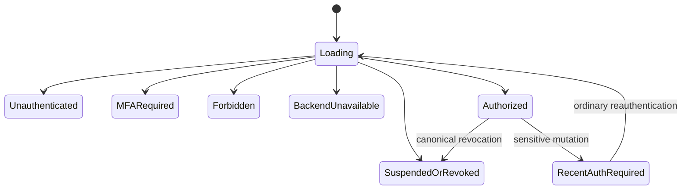
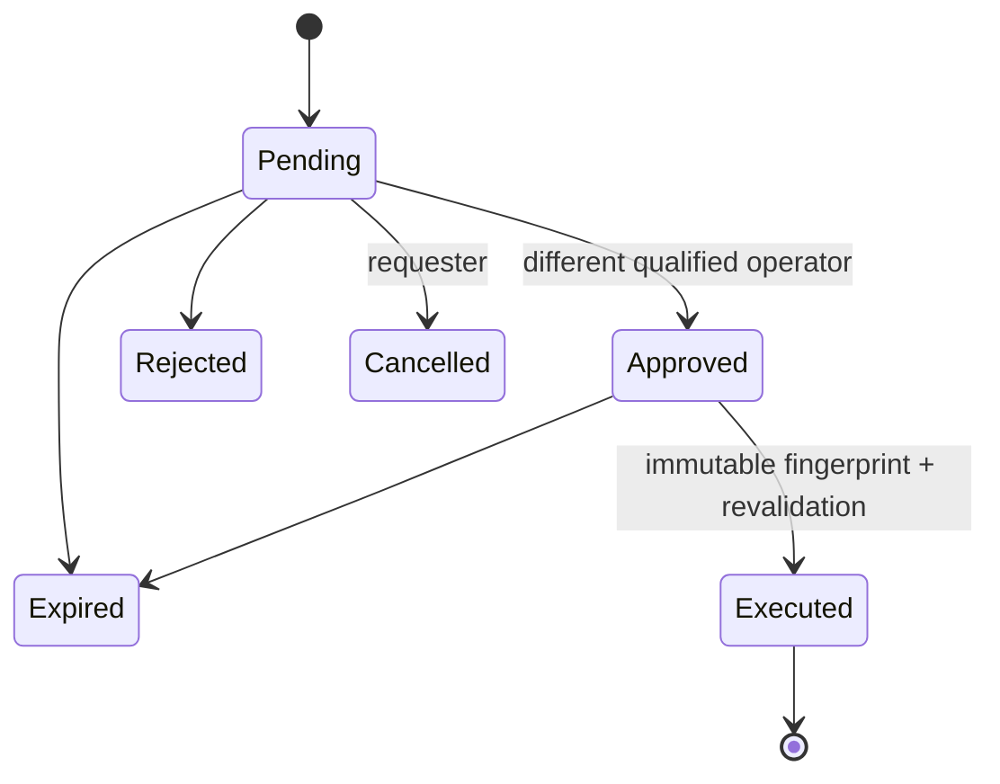

# Lovable Admin Console Handoff

This is the authoritative Lovable task source for the Phase 7D BotolaGO Admin
Console. Build the visual and interaction layer only over the frozen server
contracts. Keep the current consumer application unchanged.

## Non-negotiable boundaries

Lovable must not:

- implement authorization or infer it from hidden UI;
- create roles, permissions, assignments, approval state, points, or worker
  outcomes client-side;
- query `auth`, `app`, or `app_private` tables;
- use a Secret/service-role credential;
- bypass route loaders, repository contracts, MFA, AAL2, recent auth,
  idempotency, dual control, or the last-admin safeguard;
- persist sensitive pending mutations for automatic replay;
- claim arbitrary-user global Supabase sign-out;
- add an Admin link to consumer navigation;
- invent Editorial, Football, Fantasy, Notifications, support, analytics, or
  provider capabilities.

## Route inventory

- `/admin`: access gate and safe home.
- `/admin/staff`: staff list, exact eligibility lookup, principal creation,
  standard role assignment, platform-admin request.
- `/admin/staff/$principalId`: detail, active assignments, immutable history,
  suspend/restore/emergency boundaries already supported by contracts.
- `/admin/approvals`: queue, detail, decision, cancellation, exact-once
  approved execution.
- `/admin/audit`: bounded audit browser.
- `/admin/security`: canonical revocation and worker-health status.

Do not rename routes or add consumer navigation. Route authorization remains
server-side.

## Component inventory

Build reusable visual components:

- `AdminShell`, `AdminHeader`, `AdminPermissionNav`, `AdminBreadcrumbs`;
- `AdminAccessState`, `AdminErrorState`, `AdminEmptyState`, `AdminSkeleton`;
- `StaffSummaryCard`, `ExactEligibilityForm`, `RoleAssignmentDialog`;
- `AssignmentList`, `AssignmentHistoryTimeline`;
- `PlatformAdminRequestDialog`, `ApprovalQueue`, `ApprovalDetail`;
- `AuditEventList`, `AuditFilterBar`, `SyntheticEvidenceBadge`;
- `SecurityStatusCard`, `RevocationStatusCard`, `WorkerRunList`;
- `EmergencyRevocationDialog`, `RecentAuthPrompt`, `MfaRequiredPrompt`;
- `SafeMaskedIdentity`, `StatusBadge`, `CorrelationReference`.

Components consume the existing repository/DTO types. They do not call
Supabase directly from presentational code.

## State model



Dual control:



Approval is not execution. Never display a grant before execution succeeds.

## Permissions matrix

| Surface                                     | Permission                                      |
| ------------------------------------------- | ----------------------------------------------- |
| Staff and approvals                         | `security.manage_staff`                         |
| Audit                                       | `security.read_audit`                           |
| Security/revocation status                  | `security.revoke_staff`                         |
| Provider session intent                     | `users.revoke_sessions` through server mutation |
| Bootstrap/readiness/worker execution/replay | No browser permission; trusted server only      |

`security_admin` has the four permissions above and no domain mutation
authority. `platform_admin` remains the broad security administrator but
cannot bypass dual control or the last-admin safeguard.

## Synthetic DTO examples

Safe staff:

```json
{
  "principalId": "71000000-0000-4000-8000-000000000001",
  "maskedEmail": "o***@e***.test",
  "status": "active",
  "mfaVerified": true,
  "roles": [{ "name": "security_admin", "expiresAt": null }]
}
```

Safe approval:

```json
{
  "approvalId": "72000000-0000-4000-8000-000000000001",
  "operation": "staff.assign_platform_admin",
  "status": "pending",
  "targetSummary": "s***@e***.test",
  "expiresAt": "2026-07-25T12:00:00Z",
  "fingerprint": "sha256:synthetic-example"
}
```

Safe worker status:

```json
{
  "queue": { "pending": 0, "processing": 0, "retrying": 0, "deadLetter": 0 },
  "runs": []
}
```

Do not add fields that imply global sign-out or expose session/provider
payloads.

## Visual direction

Use BotolaGO Design System V2:

- premium dark football-operations surface;
- restrained emerald security accents;
- subtle mesh gradients and glassmorphism only where contrast remains AA;
- dense operational data with generous touch targets;
- clear hierarchy: outcome → target → actor/time → correlation evidence;
- amber for pending/recent-auth, red for destructive/revoked, emerald for
  verified/success, neutral slate for unavailable/empty;
- avoid decorative motion during destructive confirmation.

This guidance is visual only. Do not redesign the consumer product.

## Responsive layouts

- Mobile: one-column cards, bottom-safe confirmation actions, compact
  filters, no clipped tables.
- Tablet: two-column summaries, stacked mutation panels.
- Desktop: bounded 1200px operational workspace, optional list/detail split.
- Preserve logical reading order and full RTL at every breakpoint.

## Arabic and RTL

- Every user-facing string needs French and Arabic source text.
- In Arabic, set the shell to `dir="rtl"` and use logical CSS properties.
- Keep UUIDs, UTC timestamps, codes, and hashes in LTR isolates.
- Mirror chevrons/back arrows, not shield/status icons.
- Test long Arabic labels and mixed-direction masked identities.

## Destructive actions

Emergency revocation must:

1. name the masked target and affected roles;
2. explain immediate Admin denial;
3. state that provider session handling is bounded and may not terminate every
   consumer session;
4. warn about the last-platform-admin safeguard;
5. require a safe reason and explicit confirmation;
6. discard the attempt on recent-auth/MFA failure;
7. show canonical result before queued provider result.

No optimistic success is allowed for destructive actions.

## Accessibility acceptance

- WCAG AA contrast.
- Keyboard-complete navigation and dialogs.
- Visible focus.
- Semantic landmarks/headings/lists/tables.
- Programmatic labels/descriptions and associated field errors.
- Live-region announcements for async result changes.
- Reduced-motion support.
- 44px minimum interactive targets.
- No color-only meaning.

## Required browser test IDs

- `admin-access-gate`
- `admin-home`
- `admin-navigation`
- `admin-nav-staff`
- `admin-nav-approvals`
- `admin-nav-audit`
- `admin-nav-security`
- `admin-staff-list`
- `admin-user-eligibility`
- `admin-create-principal`
- `admin-role-assignment`
- `admin-assign-role`
- `admin-platform-request`
- `admin-request-platform-admin`
- `admin-staff-detail`
- `admin-assignments`
- `admin-assignment-history`
- `admin-emergency-revocation`
- `admin-approvals-queue`
- `admin-approval-detail`
- `admin-audit-log`
- `admin-security-status`
- `admin-revocation-status`
- `admin-worker-health`
- `admin-mfa-required`
- `admin-recent-auth-required`
- `admin-access-revoked`
- `admin-backend-unavailable`
- `admin-permission-denied`
- `admin-reauthenticate`
- `admin-route-loading`

Test IDs are stable automation hooks, not authorization controls or accessible
labels.

## Definition of done for Lovable

- Every frozen route and state is visually complete in French and Arabic.
- RTL, mobile, tablet, desktop, keyboard, screen-reader, focus, loading, empty,
  error, confirmation, success, and disabled states pass.
- Components use only frozen repositories/DTOs.
- No service credential, private table, direct authorization, consumer-nav
  entry, domain mutation, or global-sign-out claim is introduced.
- Existing server and browser contract tests remain green.
