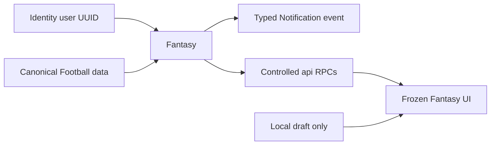

# Phase 6 — Canonical Fantasy Domain Plan

## Status and phase boundary

This document is the required pre-migration audit and target design for the
greenfield BotolaGO V2 Fantasy domain. It was completed before any Phase 6
migration was created.

Fantasy becomes authoritative for rules, eligibility, prices, squads, lineups,
transfers, chips, points, substitutions, results, leagues, and rankings. It
consumes canonical Identity and Football UUIDs and may emit typed Notification
events. It never modifies Football facts or makes Notifications calculate
Fantasy facts.

The legacy project, archived migrations, legacy generated types, and archived
`public.*` Fantasy RPCs are non-authoritative references and remain untouched.
Production workers, cron, Admin CMS, analytics, payments, and deployment are
outside Phase 6.

## 1. Frontend dependency map

| Surface            | Current dependency                                           | Current authority problem                            | V2 contract                                        |
| ------------------ | ------------------------------------------------------------ | ---------------------------------------------------- | -------------------------------------------------- |
| Fantasy hub        | `botolaService` mock summary/GW/alerts plus mock leagues     | totals/ranks can be fabricated                       | server hub DTO with nullable computed rank         |
| Create Team        | mock players/clubs/GW; `FantasyOwnedRepository.saveTeam`     | browser supplies bank/rules; old RPC uses JSON squad | atomic create RPC with idempotency/version         |
| Team               | owned snapshot plus local lifecycle store                    | chips/deadline/captaincy can be client-authoritative | team/squad/lineup DTO and versioned mutations      |
| Transfers          | browser preview/apply engine                                 | bank, free transfers, hits supplied by client        | server preview and atomic confirmation             |
| Points             | browser computes/finalizes scoring                           | client can persist points/finalize                   | read-only provisional/final result DTO             |
| History            | mock results/local lifecycle JSON                            | mutable and unbounded                                | immutable keyset gameweek history                  |
| Fixtures           | mock difficulty                                              | disconnected from Football UUIDs                     | Fantasy fixture projection from Football           |
| Rules              | hardcoded translated cards/constants                         | rules scattered in client                            | current versioned ruleset DTO                      |
| Top players        | generated mock ranks                                         | fabricated ownership/rank                            | computed player totals; null rank until calculated |
| Leagues            | `leaguesStore` localStorage with random five-character codes | no ownership/privacy/authority                       | transactional league RPCs and standings            |
| Player detail/pool | generated mock players and local watch list                  | mock IDs/prices/ownership                            | canonical Fantasy-player UUID DTOs                 |
| Import/empty cloud | legacy public tables and ID mapping                          | old schema assumptions                               | no legacy import; empty V2 creates canonical team  |
| Draft/conflict     | `fantasyDraftsStore` keyed by user/team/version              | valid draft-only behavior                            | preserve unchanged; clear only after success       |

### Routes and adapters audited

The audit covered every `src/routes/fantasy*.tsx` route, the owned provider,
mutation controller, cloud/local repositories, create/import/finalize services,
ID/gameweek resolvers, payload builders, mock service, draft/lifecycle stores,
points/transfers/rules engines, leagues store, tests, and archived RPC
assumptions.

Key compatibility requirements:

- current route shapes use 15 players, slots 1–11 plus bench 12–15, one captain,
  one vice-captain, seven supported formations, decimal prices, and explicit
  versions;
- French/Arabic and RTL are presentation concerns; DTO names are localized
  using the profile language;
- the conflict UI requires latest safe version metadata without overwriting its
  draft;
- empty-cloud users must remain directed to Create Team;
- loading/error/empty states and visual components remain frozen;
- production must never silently select the local adapter.

## 2. Domain boundaries

Football owns competitions, seasons, rounds, teams, players, fixtures, lineups,
events, and statistics. Fantasy references those rows and owns position,
eligibility, price, selection, rules, points, and ranking. Provider payloads
never enter Fantasy scoring.

## 3. Canonical entity model

### Catalog and rules

- `fantasy_competitions`: Football competition link, name, active state.
- `fantasy_rulesets`: immutable version, budget/squad/club/transfer/captain
  configuration and lifecycle.
- `fantasy_positions` and `fantasy_position_rules`: position code, squad
  quota, starting min/max, bench behavior, and scoring identity.
- `fantasy_scoring_rules`: ruleset/category/position point values and
  thresholds.
- `fantasy_seasons`: Football season link, ruleset, active dates/status.
- `fantasy_gameweeks`: Football round link where present, sequence, server
  deadline, lifecycle, scoring/finalization version.
- `fantasy_players`: season + Football player/team + position, eligibility,
  availability, current price, active state.
- `fantasy_player_price_history`: immutable effective price changes.

### Owned team state

- `fantasy_teams`: one user/team per season, validated name, server bank/team
  value/free transfers, current gameweek, explicit version/status.
- `fantasy_squad_memberships`: temporal ownership with purchase/current sale
  price and acquired/sold gameweek.
- `fantasy_lineups` and `fantasy_lineup_players`: immutable per-gameweek
  snapshot, XI/bench order, captain/vice and multiplier.
- `fantasy_transfer_batches` and `fantasy_transfers`: idempotent immutable
  transaction header/detail with server-derived bank, free transfers, and hit.
- `fantasy_chip_uses`: authoritative activation/cancellation/finalization.
- `fantasy_free_hit_snapshots` and players: capture-once original squad.

### Scoring and history

- `fantasy_player_point_events`: explainable fixture/player/category facts
  with source-version idempotency.
- `fantasy_player_gameweek_points`: provisional/final player totals.
- `fantasy_team_gameweek_results`: provisional/final team totals, hit, chip,
  captain and nullable computed ranks.
- `fantasy_auto_substitutions`: ordered, auditable substitutions/reasons.

### Leagues and operations

- `fantasy_leagues`: season, public/private visibility, creator, keyed invite
  digest, active state.
- `fantasy_league_memberships`: unique active membership and role.
- `fantasy_rankings`: overall/gameweek/league ranks with deterministic
  tie-break facts and calculation version.
- private idempotency, mutation audit, scoring/finalization/ranking run ledgers,
  and correction records live in `app_private`.

Core state is relational. Bounded JSON is limited to immutable audit-safe
metadata and typed worker checkpoints, never squads, rules, points, or
rankings.

## 4. Ruleset and validation model

Rulesets are immutable once used. The initial Botola ruleset preserves the
approved v1.0 contract: budget 100.0, squad 15, maximum three per club, two GK,
five DEF, five MID, three FWD, legal XI of one GK/3–5 DEF/2–5 MID/1–3 FWD,
one free transfer per transition, maximum two rollover, four-point paid
transfer hit, captain multiplier two and triple-captain multiplier three. The
complete immutable decision record is `FANTASY_RULES_V1.md`.

Database helpers validate team names, selected eligible players, duplicates,
position quotas, real-team limit, current server prices, budget, 11 starters,
bench ordering, exactly one distinct captain/vice, and legal formation.
Application rule helpers mirror these rules for immediate preview but the RPC
is final authority.

## 5. Gameweek lifecycle and deadlines

`scheduled → open → locked → live → provisional → finalizing → finalized`.
`corrected` and `cancelled` are explicit exceptional states.

All mutations lock the team and gameweek rows and compare
`statement_timestamp()` with the deadline inside the transaction. Client
clocks and UI countdowns never authorize a mutation. Only trusted workers can
transition lifecycle state. A finalized gameweek short-circuits repeated work;
corrections use a new calculation version and audit record.

Only one open/live operational gameweek per Fantasy season is permitted by a
partial unique index.

## 6. Team, squad, lineup, concurrency, and drafts

Team creation is one transaction keyed by user, season, and idempotency key.
The server calculates price total/bank and creates team, temporal memberships,
initial lineup, chip availability/audit, and mutation result atomically.

Squad ownership and historical lineup are separate. Transfers end/start
temporal memberships; historical lineups never change with the current squad.
Lineup mutations require `expected_version`, lock team/gameweek, validate
server time and rules, and increment the version. Conflicts return the stable
`version_conflict` error; the client reloads safe state while retaining the
draft keyed by old version.

`fantasyDraftsStore` remains the only local write authority and only for
create/team/transfers/captain/bench/chip drafts. `fantasy.state`,
`fantasy.leagues`, legacy ID maps, lifecycle JSON, and old public RPCs are
quarantined from production selection.

## 7. Transfers and free-transfer rollover

Preview is server-derived and non-mutating. Confirmation locks the gameweek,
team, current memberships, incoming players, prices, and idempotency key. It
validates equal unique in/out sets, ownership/eligibility, resulting quotas,
club limit and budget. Sale price uses immutable purchase price plus configured
gain sharing; the server calculates bank, transfer count, free usage and hit.

The transfer batch and detail ledger are immutable. Duplicate retries return
the first result; same idempotency key with different request fingerprint is an
`idempotency_conflict`.

Rollover is a per-team/gameweek transition ledger applied once. Wildcard and
Free Hit preserve configured post-gameweek free-transfer behavior and cannot
double-roll.

## 8. Chips

Only Wildcard, Free Hit, Bench Boost, and Triple Captain are seeded. Season
configuration controls availability/period/multiplier/cancellation.

Activation is one idempotent transaction before deadline. A team has at most
one active chip per gameweek and one use per configured allocation. Confirmed
v1.0 activations are non-cancellable. The two Wildcard allocations use the
published season split; Free Hit, Bench Boost, and Triple Captain each have one
season allocation.

- Wildcard makes the gameweek transfer hit zero and preserves transfer ledger.
- Free Hit captures the original memberships/prices/bank exactly once, uses a
  temporary squad/lineup, and restores once after finalization.
- Bench Boost includes bench points for that gameweek.
- Triple Captain applies ruleset multiplier; vice promotion uses normal captain
  multiplier if the captain does not play.

## 9. Scoring and substitutions

Versioned scoring categories cover appearances/minutes, position goals,
official assists, clean sheets, goals conceded, saves, penalty saves/misses,
cards, and own goals. Bonus and player-of-the-match are disabled in v1.0. A scoring worker reads only normalized Football fixtures,
lineups, events and statistics. Point-event uniqueness uses
fixture/player/category/source-version so retries do not duplicate.

Provisional recalculation replaces the derived version only when Football
freshness is newer. Finalization freezes a scoring input version.

Automatic substitutions are deterministic: non-playing starters, goalkeeper
only for goalkeeper, bench order, formation preservation, captain absence and
vice promotion. Bench Boost disables ordinary bench exclusion. Substitutions
are persisted, ordered, and idempotent.

## 10. Finalization pipeline

1. Claim one gameweek run with an expiring lease.
2. Verify every included Football fixture is final or explicitly resolved.
3. Freeze source sequence/version.
4. Calculate explainable player events and totals in bounded fixture batches.
5. Calculate owned team results in keyset batches.
6. Apply automatic substitutions, captain multiplier, chips and hits.
7. Restore Free Hit exactly once and roll free transfers exactly once.
8. Advance team gameweek context.
9. Calculate overall/gameweek/league rankings in bounded batches.
10. emit typed `gameweek_finalized`/position-change notification events.
11. Mark finalized.

Runs persist checkpoint, counters, lease, sanitized error and retry state.
Transactions are per bounded stage/batch; unique constraints and state compare
and set make retries safe. Notification emission occurs only after the
authoritative result commit and uses a stable deduplication key.

## 11. Leagues and ranking

Private invite codes contain at least 128 bits of randomness; only a digest is
stored after creation. Because the code cannot be shown twice, the owner can
replace it (`api.reset_fantasy_league_invite_code`): the old code stops working
at once, the new one is returned once under the same rules, and existing
members are unaffected. Public/private visibility is explicit. Creator becomes
owner membership atomically. Join/leave/admin operations are owner/member safe,
and the owner cannot leave without an ownership transfer or archive action.

Rank ordering is total points descending, accumulated transfer-hit points
ascending, confirmed transfers ascending, latest finalized gameweek score
descending, team creation ascending, and team UUID ascending. Rank/movement is
null until a calculation exists; no value is fabricated. Large standings use
keyset pages and versioned ranking snapshots.

## 12. API/RPC and DTO strategy

Only controlled `api` RPCs are exposed:

- hub, current team, player pool/detail, fixtures/rules;
- create team, save lineup/captaincy;
- preview/confirm transfers;
- activate/cancel chip;
- points/history;
- league list/detail/create/join/leave and standings;
- trusted lifecycle, scoring, finalization, correction and ranking claims.

Writes accept expected version and important writes accept UUID idempotency
keys. DTOs are provider-independent, explicitly nullable, language-aware and
contain no worker/audit/provider metadata. Route components call repository
facades only.

## 13. RLS, grants, and authority

Every Fantasy table enables and forces RLS, including private ledgers.
`app` and `app_private` stay outside the exposed schema and receive no
browser table grants. Owner/public/member reads and all mutations are controlled
by narrowly granted security-definer RPCs with empty search path and explicit
caller checks.

Browsers cannot directly write teams, squads, points, prices, rules, chips,
rankings, or deadlines. Authenticated mutations operate only on
`auth.uid()` teams. Private-league reads require membership. Only
`service_role` invokes lifecycle/scoring/finalization/ranking/correction
functions; it still has no direct private-table grants.

## 14. Background processing and observability

Small manual/staging workers own gameweek transition, provisional scoring,
fixture finalization, gameweek finalization, Free Hit restoration, rollover,
rankings, price changes, and Notification event emission. No production
schedule is activated.

Private run/audit ledgers track accepted/rejected mutations, deadline/version
conflicts, transfer calculations, chip state, source versions, scoring and
correction counts, checkpoints, retries, durations, stable errors, Free Hit
restoration, rollover, ranking and notification emission. Logs exclude
credentials and unnecessary personal data.

## 15. Performance and indexing

Indexes follow actual reads: active gameweek by season/deadline, eligible player
pool by season/position/team/price, team by user/season, active memberships,
lineup/history by team/gameweek, transfer/chip ledgers, provisional/final
points, finalization claims, league membership, and ranking pages.

Mutations take row locks in deterministic order. Deadline traffic uses one
short team transaction, no unbounded audience or league recalculation.
Growing feeds use keyset pagination. Redis is not justified until staging
measurements show database contention.

## 16. Frontend cutover

Add V2 Fantasy DTO/repository/service contracts and Supabase/mock adapters.
Production requires `VITE_FANTASY_DATA_MODE=supabase`; missing or mock
production configuration fails closed. Current previews retain deterministic
mocks.

The owned provider remains the single user snapshot coordinator, but its cloud
adapter moves to V2 `api` RPCs and V2 generated types. Player, rules, points,
history and leagues move behind the same facade. Local storage is never read as
canonical in cloud mode. Duplicate legacy adapters are left as explicit
archive-only modules until route cutover is verified, then no V2 import may
reference them.

## 17. Testing and migration plan

Migrations are additive, replayable from zero, explicitly indexed/granted,
forced-RLS, and created with the Supabase CLI. Tests cover rules/formation,
atomic/idempotent creation, transfers/budget/hits/deadlines/version conflicts,
all four chips and Free Hit restore, scoring categories/provisional correction,
substitutions/captain, resumable finalization/rollover/notification events,
leagues/ranks/privacy, worker authority, DTO/mock/draft/fail-closed behavior,
clean replay and generated-type drift.

Implementation order:

1. catalog/rules/gameweeks/player eligibility;
2. teams/squads/lineups/transfers/chips;
3. scoring/results/leagues/private run ledgers;
4. validation and transactional owner/worker RPCs;
5. indexes/RLS/grants and deterministic seed data;
6. V2 types, rule/scoring/worker services and repository cutover;
7. pgTAP/RLS/unit/integration tests;
8. zero replay, query plans and V2 staging validation.

## 18. Risks and rollback

- V2 staging has no production Football population; deterministic canonical
  Football fixtures are required for database tests.
- BotolaGO Fantasy v1.0 is approved and encoded. A concrete season still needs
  an explicit activation record before registration is opened.
- Current UI assumes mock ownership/form/expected points; these remain nullable
  until computed.
- Deadline-scale concurrency and large-league ranking need representative load
  tests.
- Phase 6 is temporarily stacked on the unmerged Phase 5 draft.

Rollback keeps the additive schema dormant: stop manual workers, keep cron
disabled, revert application mode/code, and prefer a reviewed forward repair
over destructive down SQL. Disposable staging can replay the last approved
migration set before real data. Production and legacy require no rollback
because neither is modified.
