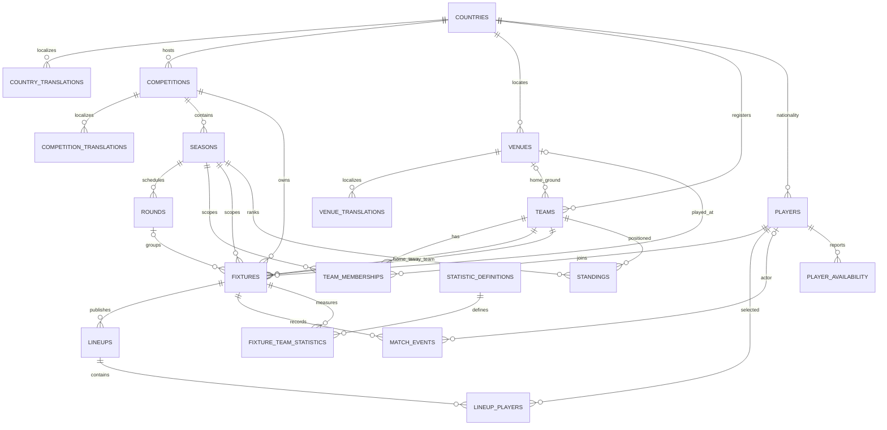
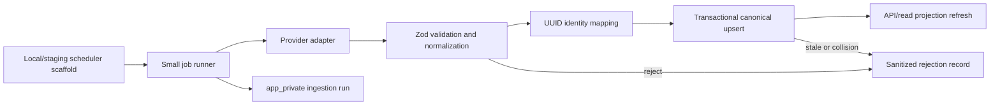

# BotolaGO V2 — Canonical Football Domain Plan

Status: Phase 3 implementation contract

Branch: `backend/football-domain`

Authority: BotolaGO Production V2 only
Legacy status: archive-only; no legacy schema, migration, provider ID, or DTO is canonical

## Executive decision

Football is a server-authoritative, provider-independent bounded context. Canonical records use internal UUIDs in the non-exposed `app` schema. Provider identity, ingestion state, rejected input, and operational runs live in non-exposed `app_private`. Browsers read stable DTOs only through explicitly granted objects in `api`; browsers cannot write football data.

No production provider has been selected for Phase 3. The implementation therefore ships a complete provider contract, strict normalization and validation, a deterministic fixture adapter, and modular ingestion jobs. It does not pretend that fixture data is live and it does not activate production schedules.

The frozen frontend remains visually unchanged. Football routes move behind a repository selector with two explicit modes:

- `mock` for previews and deterministic tests.
- `supabase` for V2 data, failing closed when V2 configuration is absent or malformed.

There is no production fallback from Supabase to mock data.

## 1. Frontend dependency map

### Current route and component dependencies

| Surface                          | Current calls                                               | Shape and behavior                                                                                                   | Phase 3 contract                                                                                                                                        |
| -------------------------------- | ----------------------------------------------------------- | -------------------------------------------------------------------------------------------------------------------- | ------------------------------------------------------------------------------------------------------------------------------------------------------- |
| Home `/`                         | `getLiveOrUpcoming`, `getClubs`                             | Up to three live/scheduled matches; club lookup per card; ISO kickoff; localized venue                               | `FootballRepository.getHomeMatches`; one DTO response with embedded team summaries                                                                      |
| Matches `/matches`               | `getMatches`, `getClubs`, `getTable`                        | Fetch-all then client date/status filtering; client grouping; separate standings query                               | Date-bounded keyset query with normalized statuses, embedded teams, competition grouping; standings query remains a separate bounded read               |
| Match detail `/matches/$matchId` | `getMatches`, `getClubs`, `getTable`; News remains separate | Finds one fixture by scanning all matches; computes H2H client-side; no timeline/lineup/stat UI yet                  | `getMatchDetail`, `getHeadToHead`, `getStandings`; dedicated timeline/lineup/stat methods ready for later UI integration                                |
| Match cards                      | `Match`, `Club`                                             | Four domain statuses plus presentation-only future states; localized names/venue; placeholder crest from colors/code | Compatibility adapter maps normalized statuses and UUID DTOs without changing components                                                                |
| Profile/onboarding               | `getClubs`                                                  | Favorite team currently stores a frozen mock key such as `war`                                                       | Canonical team UUID for cloud writes; explicit mock-key mapping during controlled seed/cutover only                                                     |
| News routes                      | `getClubs`                                                  | Uses clubs for article labels                                                                                        | Not cut over in Phase 3; remains behind existing mock service until News phase                                                                          |
| Fantasy routes                   | `getClubs`, fantasy mock players and fixtures               | Fantasy-specific price, ownership, points, difficulty and local IDs                                                  | Not cut over. A provider-independent Football player/team interface is exposed for the later Fantasy phase; no fantasy attributes enter Football tables |
| MCP `list_fixtures`              | Direct query against legacy `fixtures`                      | Wrong schema/shape and raw error leakage                                                                             | Cut to the controlled `api` football RPC and stable error output                                                                                        |

### Routes that do not currently exist

The frozen repository has no standalone public team, player, or competition route. Phase 3 still defines repository contracts and database read models for these domains so future route work will not require schema changes. It does not invent UI.

### Existing mock assumptions

- Team IDs, player IDs, fixture IDs, and competition references are short strings, not UUIDs.
- A `Club` embeds French and Arabic names, short names, and city.
- `MatchStatus` is only `scheduled | live | finished | postponed`.
- A match embeds a numeric gameweek, localized venue, nullable score, and optional minute.
- All dates are ISO timestamps and the browser renders them in `fr-FR` or `ar-MA` using the local time zone.
- Matches are fetched without pagination and filtered in the browser.
- Standings are a single implicit Botola table with no competition/season identity.
- Match detail derives H2H by scanning the complete fixture list.
- Crest rendering currently uses a placeholder abbreviation and colors; no licensed image asset is required for UI compatibility.
- Loading, error, empty, French, Arabic, and RTL behavior are already present and must be preserved.

### Compatibility rule

The canonical DTO model is richer than the frozen UI model. A compatibility adapter translates UUID-based, normalized Football DTOs into the existing `Club`, `Match`, and `TableRow` presentation contracts. The adapter is temporary and isolated; canonical tables and RPCs are never distorted to match mock-only limitations.

## 2. Canonical entity model

### Entity decisions

- UUID primary keys are generated by Postgres and never derived from providers.
- Slugs are lowercase canonical identifiers with explicit unique constraints.
- `created_at` and `updated_at` use `timestamptz` and database time.
- Countries, competitions, and venues use relational translation tables keyed by language. Team and player identity rows are not duplicated per language.
- Team membership is temporal and season-scoped; `players` has no mutable `current_team_id` authority.
- Scores are relational columns with non-negative checks. Winner must be one of the fixture teams.
- Lineups and events are normalized rows, not JSON payloads.
- Statistic names are controlled by definitions; fixture values reference those definitions.
- Standings are snapshot rows unique by season, group, team, and table type.
- Player availability is football availability only. Fantasy interpretation is out of scope.

## 3. Provider abstraction

The TypeScript boundary contains:

- `FootballProvider` capability interface.
- Normalized provider DTOs for competitions, seasons, rounds, teams, players, squads, fixtures, standings, lineups, events, statistics, and availability.
- Zod validation at the untrusted payload boundary.
- Exhaustive provider-status mapping into canonical fixture statuses.
- Page/cursor, rate-limit, freshness, source-version, and request metadata.
- Stable provider error taxonomy with retryability and sanitized context.
- A deterministic fixture adapter for tests and preview development.

Provider payload types are adapter-private. They cannot be imported by route components, canonical DTO modules, or Fantasy.

### Provider selection criteria

Before selecting a production source, validate Botola Pro coverage, lineup/event/stat depth, documented correction semantics, update timestamps or versions, live latency, historical depth, rate limits, redistribution and image rights, SLA, webhook support, sandbox quality, and exit/export terms. A provider lacking stable identities or correction metadata requires a compensating snapshot strategy and is not acceptable for live authority.

## 4. Ingestion architecture

Jobs are separate capabilities: competitions, seasons, rounds, teams, squads/players, fixtures, standings, lineups, live fixtures, events, statistics, availability, and fixture finalization. The shared runner provides bounded concurrency, provider timeouts, quota accounting, exponential backoff with jitter, a retry budget, cursor checkpointing, and a temporary circuit breaker.

No production cron is activated. Scheduling defaults are configuration only and local tests call jobs directly.

## 5. Provider identity mapping

`app_private.football_provider_mappings` maps `(provider, entity_type, external_id)` to an internal UUID. The internal UUID remains canonical. A database trigger verifies that the UUID exists in the canonical table corresponding to `entity_type`, providing integrity despite the generic mapping shape.

Rules:

- Provider/entity/external ID is unique.
- Provider/entity/internal UUID is unique to prevent a provider from assigning multiple external identities to one canonical row without explicit correction.
- Resolution uses transaction-level advisory locks for idempotency.
- A different existing UUID for the same external identity is a mapping collision, never a silent remap.
- Manual corrections record actor, reason, and timestamp and are reserved to trusted future admin operations.
- Provider replacement adds new mapping rows; canonical UUIDs and frontend URLs remain stable.

## 6. Stale-write and correction strategy

| Volatile entity | Ordering protection                                                      | Correction behavior                                                                                                                         |
| --------------- | ------------------------------------------------------------------------ | ------------------------------------------------------------------------------------------------------------------------------------------- |
| Fixture         | provider timestamp plus source version                                   | Older updates are skipped; same-version conflicting updates are rejected; newer corrections may change scores/status subject to state rules |
| Match event     | provider mapping or deterministic idempotency key plus provider sequence | Duplicate delivery is ignored; newer versions update the same event; sequence preserves display order                                       |
| Standing        | provider timestamp per season/group snapshot                             | Older snapshots cannot overwrite newer rows                                                                                                 |
| Lineup          | provider timestamp/version per fixture/team                              | Newer confirmed lineup replaces/upserts membership transactionally                                                                          |
| Statistics      | provider timestamp/version per fixture/team/definition                   | Latest valid value wins; older payload is skipped                                                                                           |
| Availability    | provider timestamp/version per provider identity                         | Corrections update the canonical interval; older payload is skipped                                                                         |

Terminal fixture regression is denied by default. A trusted correction may move a finalized fixture only through an explicit correction path that records the reason. `finished`, `cancelled`, and `abandoned` are not silently regressed by polling.

## 7. Read-model and API strategy

`app` and `app_private` are not exposed by PostgREST. Direct table grants to `anon` and `authenticated` remain revoked. The `api` schema exposes only bounded, DTO-focused functions and the narrowly scoped live projection.

Read contracts:

- `football_home_matches(limit, language)`
- `football_matches_by_date(date, statuses, competition, cursor, limit, language)`
- `football_live_matches(limit, language)`
- `football_match_detail(fixture_id, language)`
- `football_match_timeline(fixture_id, language)`
- `football_match_lineups(fixture_id, language)`
- `football_match_statistics(fixture_id, language)`
- `football_head_to_head(fixture_id, limit, language)`
- `football_competition_summary`, fixtures/results, and standings
- `football_team_summary`, current squad, fixtures, and standing
- `football_player_summary` and availability

Complex route responses are assembled once in the database or repository layer so components do not issue per-card or N+1 queries. List reads are bounded. Growing fixture/event feeds use deterministic keyset order.

### Stable DTOs

TypeScript DTOs are provider-independent and explicitly nullable:

- match card, grouped matches, and live-match summary
- match-detail header and metadata
- timeline item
- lineup and lineup player
- statistic comparison
- standing row
- competition summary
- team summary
- player summary
- availability status

Internal mapping IDs, raw provider fields, ingestion counters, source credentials, and operational errors are excluded.

## 8. Live-update strategy

Live reads use a sanitized `api.live_fixture_updates` projection maintained by canonical fixture changes. It contains only public match-card fields and freshness/version values, is RLS-enabled, grants read-only access, and is the only Phase 3 table added to the Realtime publication. Canonical tables remain non-exposed and unpublished.

Scheduling eligibility is testable configuration:

- scheduled fixtures within the pre-kickoff window: low cadence increasing near kickoff;
- live, delayed, half-time, extra-time, or penalties: high cadence;
- suspended: reduced recovery cadence;
- finished: short correction window, then stop;
- cancelled or abandoned: stop unless a trusted reconciliation job requests a refresh.

Realtime is an invalidation/update hint, not the authority. Clients re-read stable API DTOs after a projection event. Provisional and finalized freshness markers are explicit.

## 9. RLS and grants

- Every `app` and `app_private` table has RLS enabled and forced.
- Canonical football tables have no browser policies and no browser object grants: deny by default.
- `service_role` is not exposed to the browser. Trusted ingestion uses server credentials and controlled database functions.
- `api` functions have an empty search path, validated arguments, bounded output, explicit `EXECUTE` grants, and no dynamic SQL.
- Safe public read RPCs are granted to `anon` and `authenticated` only.
- Operational/write RPCs are not granted to browser roles.
- `api.live_fixture_updates` permits public/authenticated SELECT only and no writes.
- Direct `app` access and all `app_private` access are tested as denied.

## 10. Observability and resilience

`app_private.football_ingestion_runs` records provider, job type, scope, status, checkpoint, timestamps, counts, retry count, stable error code, and a bounded sanitized summary. `football_ingestion_rejections` records a bounded payload fingerprint and structured validation issues, not complete provider payloads or credentials.

Application logs use request/run IDs and stable error codes. Provider authorization headers, database secrets, raw access tokens, and unnecessary payload bodies are prohibited. Suggested operational metrics are run duration, fetch/validation/upsert counts, rejection ratio, mapping collision count, stale-skip count, provider quota remaining, live freshness lag, and circuit state.

Errors crossing public boundaries use stable football codes: `provider_unavailable`, `provider_rate_limited`, `invalid_provider_payload`, `mapping_not_found`, `mapping_collision`, `stale_update`, `fixture_not_found`, `competition_not_supported`, `invalid_fixture_state`, `partial_sync_failure`, `ingestion_conflict`, and `data_unavailable`.

## 11. Media strategy

Phase 3 stores a normalized media reference with source URL, optional Storage path, attribution/license fields, and validation status. Public DTOs return only validated HTTPS URLs or controlled Storage paths plus a deterministic fallback code/color.

No browser may upload Football media. No third-party image is copied to Storage until redistribution rights are confirmed. Provider URLs must not contain credentials or query secrets. Team colors and codes preserve the current UI fallback without relying on unlicensed assets.

Open risk: production provider logo, crest, player-photo, and venue-image redistribution rights must be confirmed contractually before media copying or public launch.

## 12. Performance and caching

Indexes follow observed access paths:

- fixture kickoff/date with ID tie-breaker;
- live-status partial index;
- competition/season/kickoff;
- both home and away team fixture history;
- current memberships and player/team/season history;
- standings season/group/rank;
- events fixture/period/minute/sequence;
- lineup fixture/team;
- provider mapping resolution;
- ingestion run status and freshness.

Home and match list queries return embedded team/competition summaries in one bounded call. No per-card queries are allowed. Query plans for the principal RPC backing queries are captured locally with deterministic seed data.

Caching starts with response freshness/ETag metadata and domain-specific TTL guidance: seconds for live, minutes for fixture lists, and hours for team/competition catalogs. Ingestion updates invalidate or advance freshness markers. Redis is not introduced in Phase 3; it becomes justified only when measured read or fan-out load exceeds database/read-replica and response-cache capacity.

## 13. Testing strategy

### Database

- clean replay from zero;
- type, check, FK, unique, and temporal constraints;
- mapping uniqueness and collision behavior;
- stale-write and status-transition rules;
- duplicate event prevention and ordering;
- required indexes;
- API bounds and deterministic ordering;
- RLS/grant matrix for anonymous, authenticated, service, `app`, and `app_private` access.

### Provider and ingestion

- adapter capability contract;
- payload validation and quarantine;
- exhaustive status mapping;
- pagination and quota metadata;
- timeout, 429, backoff, jitter, retry budget, and circuit breaker;
- idempotent jobs, partial failure, resume, correction, and stale update;
- deterministic samples only; no live provider dependency.

### Frontend

- canonical DTO validation;
- compatibility adapter;
- explicit mock selection;
- fail-closed Supabase selection;
- loading/error/empty preservation;
- French/Arabic fallback and RTL-safe localized strings.

CI retains migration validation, secret scanning, typecheck, all tests, lint, build, local migration replay, pgTAP, RLS tests, database lint, and generated-type drift. Phase 3 adds its branch to push checks and includes Football provider/ingestion tests in the normal Bun suite.

## 14. Migration plan

1. Add canonical catalog entities, translation tables, media references, memberships, indexes, and deny-by-default RLS.
2. Add fixtures, lineups, events, statistic definitions/values, standings, availability, provider mapping, ingestion operations, stale-write functions, and live projection.
3. Add controlled API functions, explicit grants, Identity foreign keys to canonical teams/competitions, and compatibility safeguards.
4. Add deterministic local test seed identifiers only where needed for query-plan and contract tests.
5. Regenerate V2 types from a clean local replay.
6. Apply only reviewed migrations to BotolaGO Staging V2 and run advisors. Production V2 remains unchanged pending review.

All migrations are additive, replayable, and non-destructive. No legacy migration or table is copied. Rollback before production consists of reverting the application repository selector and dropping Phase 3 objects in a separately reviewed down migration only if staging rollback is required; production receives no Phase 3 changes in this phase.

## 15. Frontend cutover plan

1. Introduce Football DTO and repository contracts.
2. Implement deterministic mock and Supabase repositories behind `VITE_FOOTBALL_DATA_MODE`.
3. Make missing or invalid Supabase configuration throw a stable `data_unavailable` error; never silently fall back.
4. Cut Home match module, Matches, Match Detail, and the fixture MCP tool to the Football repository.
5. Retain News and Fantasy mocks. Shared club presentation may use the compatibility adapter only on the cut-over Football surfaces; non-Football routes remain unchanged.
6. Preserve existing query loading, error, empty, localization, and RTL UI.
7. Enable Supabase mode in staging only after database validation and sanitized environment configuration.

## 16. Environment contract

Browser-safe:

- `VITE_FOOTBALL_DATA_MODE=mock|supabase`
- existing V2 Supabase URL and publishable key

Server-only:

- `FOOTBALL_PROVIDER=fixture|<future-provider>`
- `FOOTBALL_PROVIDER_BASE_URL`
- `FOOTBALL_PROVIDER_API_KEY`
- `FOOTBALL_INGESTION_CONCURRENCY`
- `FOOTBALL_PROVIDER_TIMEOUT_MS`
- `FOOTBALL_PROVIDER_MAX_RETRIES`
- `FOOTBALL_PROVIDER_RETRY_BASE_MS`
- `FOOTBALL_PROVIDER_CIRCUIT_FAILURE_THRESHOLD`
- `FOOTBALL_PROVIDER_CIRCUIT_RESET_MS`

Credentials are environment-specific, never prefixed `VITE_`, and never committed. Local and test default to the deterministic fixture provider. Staging may use provider sandbox credentials. Production selection and activation require separate review.

## 17. Risks and rollback

| Risk                                        | Mitigation                                                                                                     |
| ------------------------------------------- | -------------------------------------------------------------------------------------------------------------- |
| Phase 2 PR is complete but not yet merged   | Phase 3 is stacked from its head; re-check before PR creation and clearly declare dependency; never auto-merge |
| No production provider selected             | Full contract plus fixture adapter; block live claims and production scheduling                                |
| Mock IDs conflict with UUID authority       | Isolated compatibility map; no short IDs in canonical keys; cloud favorites use UUIDs                          |
| Provider identity collisions                | Transactional resolver, unique constraints, quarantine, manual correction audit                                |
| Live status corrections arrive out of order | Provider freshness/version checks and terminal-state regression guard                                          |
| Realtime fan-out becomes costly             | Publish only sanitized live projection; clients re-fetch; measure before adding Broadcast/Redis                |
| Media rights are unclear                    | Use fallback colors/codes; do not copy assets without documented rights                                        |
| API functions could bypass RLS              | Narrow security-definer surface, empty search path, no dynamic SQL, explicit grants, cross-role pgTAP tests    |
| Large historical fixture volume             | Keyset pagination, composite indexes, bounded queries, future partitioning threshold documented                |

Rollback is application-first: set staging back to mock mode, which restores the existing deterministic UI without data mutation. Database Phase 3 is additive and can remain dormant. If staging schema rollback is necessary, use a reviewed inverse migration against staging only. Never reset, delete, or replay the legacy project.

## 18. Phase boundary and next recommendation

Phase 3 ends after canonical schema, provider abstraction, mappings, modular ingestion infrastructure, read models, RLS/grants, media policy, local/staging scheduling scaffolding, Football route repository cutover, generated types, tests, and staging validation. It does not activate production cron or implement News, Fantasy scoring, notifications, admin, analytics dashboards, or production deployment.

After review and merge, Phase 4 should implement the canonical News and editorial domain against these stable competition/team/player UUIDs. Fantasy should remain a later dedicated phase so its price, rules, transfers, chips, and scoring consume Football without contaminating it.
