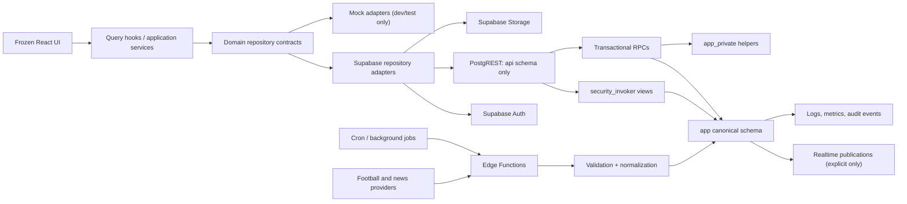
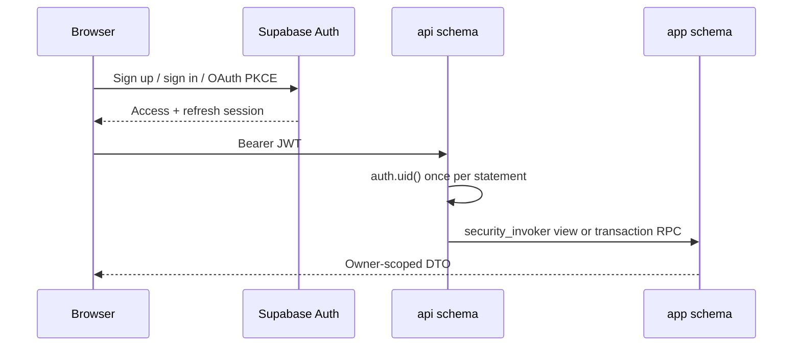
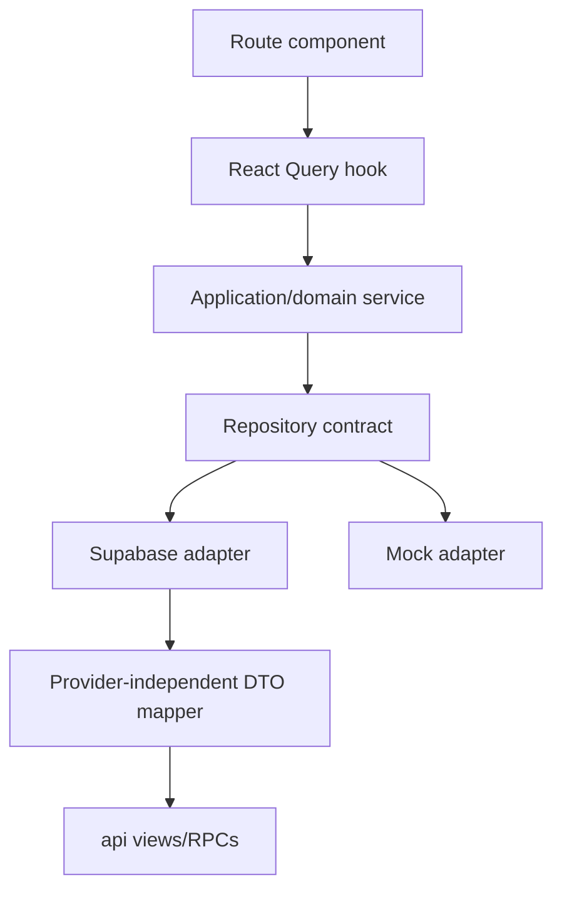
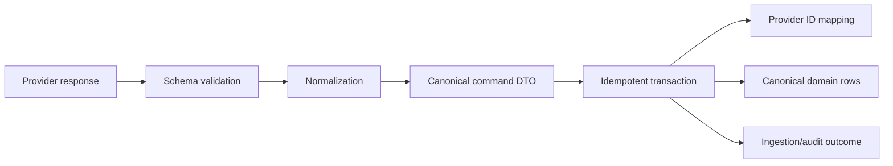
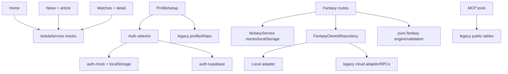

# BotolaGO Greenfield Backend Master Plan

Status: Phase 0 architecture complete; Phase 1 foundation in progress
Date: 2026-07-19
Branch: `backend/greenfield-foundation`
Target project: `BotolaGO Production V2` (`tkewgajrljbwgwedqsxn`, `eu-west-3`)
Legacy project: archive-only; never deploy or replay into V2

## Executive decision

The current Lovable React application is the product specification. Existing
Supabase code describes useful behavior, but its tables, generated types, RPCs,
policies, IDs, and migration history are not canonical. The production backend
is rebuilt additively from a clean Supabase project.

Phase 1 deliberately creates no product tables. It establishes isolated
schemas, least-privilege defaults, migrations, tests, type generation, CI,
repository contracts, typed errors, logging, and environment conventions. The
frontend remains in explicit mock mode until Phase 2 supplies a compatible auth
and user-data slice.

## Audit snapshot

The repository contains a TanStack Start/Vite React frontend with React Query,
Supabase JS, deterministic mock services, a local fantasy engine, legacy cloud
adapters, and 23 Bun test files. There is no authoritative greenfield data path
yet.

Key findings:

- Public football and editorial data comes from `src/mocks/data.ts`,
  `src/mocks/fantasy-data.ts`, `src/services/mock.ts`, and
  `src/services/fantasy-mock.ts`.
- Saved articles, followed/watch state, profile-like mock state, leagues, and
  most fantasy ownership state are persisted in browser storage.
- Auth can select a mock implementation or a legacy Supabase implementation.
  The latter directly expects `profiles`, `user_preferences`, and an `avatars`
  bucket in the exposed schema.
- Fantasy has useful repository/controller boundaries, but two overlapping
  cloud adapters still expect legacy `public` tables and RPCs.
- Route components frequently compose queries and business actions directly;
  there is no single provider-independent application service layer.
- `src/integrations/supabase/types.ts` is a legacy compatibility snapshot and
  must not influence the new schema.
- MCP tools query legacy `profiles`, `fantasy_teams`, and `fixtures` names with
  the user's bearer token.
- Current tests are mostly deterministic unit tests. There were no migration,
  pgTAP, RLS, live repository-contract, generated-type drift, or deployment
  gates before this foundation.

## 1. Target architecture

Architecture rules:

1. `app` owns canonical relational data and is not exposed through PostgREST.
2. `api` is the only Data API schema. It contains stable, explicitly granted
   views and RPCs, never raw feature tables.
3. `app_private` contains trigger, policy, and privileged helpers. It is not
   exposed and application roles receive no usage.
4. Supabase Auth owns identity and sessions. `app.profiles` will extend, never
   duplicate, `auth.users`.
5. Browser-local data is limited to drafts, optimistic state, and temporary
   offline state. It cannot be the production authority for product records.
6. Service-role work runs only in trusted server/Edge Function contexts.
7. Providers terminate at validation and normalization adapters; provider DTOs
   never leak into frontend contracts or primary keys.

## 2. Domain boundaries

| Domain             | Owns                                                                           | May depend on                      | Must not own                |
| ------------------ | ------------------------------------------------------------------------------ | ---------------------------------- | --------------------------- |
| Identity           | Supabase identity link, profile, preferences, account lifecycle                | Auth                               | Football or fantasy state   |
| Social preferences | Saved articles, followed teams/competitions, privacy choices                   | Identity, reference IDs            | Article or team definitions |
| Football catalog   | Countries, competitions, seasons, teams, venues, players, memberships          | Provider registry                  | User-owned state            |
| Match centre       | Fixtures, lineups, events, stats, standings                                    | Football catalog, providers        | Fantasy decisions           |
| Editorial          | Articles, translations, authors, tags, entity links, publication state         | Football catalog, media            | User saves                  |
| Fantasy            | Rulesets, gameweeks, player prices, squads, transfers, chips, points, leagues  | Identity, football catalog/matches | Provider raw payloads       |
| Media              | Object metadata, ownership, transformations, bucket policy                     | Identity/editorial                 | Binary data in PostgreSQL   |
| Ingestion          | Provider clients, cursors, raw receipt metadata, normalization, reconciliation | Football/editorial                 | Public DTO contracts        |
| Operations         | Audit events, jobs, idempotency keys, health and failure metadata              | All domains through events         | User-facing content         |

Cross-domain writes occur through application services or transactional RPCs,
not foreign-table mutations scattered through routes.

## 3. Database entity model

### Conventions

- UUID primary keys for all canonical entities. Supabase Auth UUIDs are reused as
  foreign keys, never copied into a second identity key.
- Lowercase `snake_case` identifiers and deterministic names:
  `<table>_<column>_key`, `<table>_<column>_idx`, and
  `<table>_<action>_<audience>` for policies.
- `timestamptz` in UTC for instants; `date` for calendar dates; exact `numeric`
  for money/prices; booleans for flags.
- `created_at` and `updated_at` are database-owned. Soft deletion is added only
  for domains that require recovery or editorial/account lifecycle.
- Closed lifecycle values use PostgreSQL enums when stable. Extensible provider,
  category, and taxonomy values use constrained reference tables.
- Every foreign-key access path is indexed. Unique and check constraints encode
  invariants at the database boundary.
- Localized content uses translation rows keyed by entity and language. JSON is
  not used as the canonical representation of relational or localized data.
- External IDs live in provider-specific mapping tables with a unique
  `(provider_id, external_id)` constraint. They are never primary keys.

### Planned logical model

This is the target model, not a Phase 1 migration.

```mermaid
erDiagram
  AUTH_USERS ||--|| PROFILES : extends
  AUTH_USERS ||--|| USER_PREFERENCES : owns
  AUTH_USERS ||--o{ SAVED_ARTICLES : saves
  AUTH_USERS ||--o{ FOLLOWED_TEAMS : follows
  AUTH_USERS ||--o{ FOLLOWED_COMPETITIONS : follows

  PROVIDERS ||--o{ TEAM_PROVIDER_IDS : maps
  PROVIDERS ||--o{ PLAYER_PROVIDER_IDS : maps
  PROVIDERS ||--o{ COMPETITION_PROVIDER_IDS : maps
  PROVIDERS ||--o{ FIXTURE_PROVIDER_IDS : maps

  COUNTRIES ||--o{ COMPETITIONS : hosts
  COMPETITIONS ||--o{ SEASONS : has
  SEASONS ||--o{ GAMEWEEKS : contains
  SEASONS ||--o{ STANDINGS : ranks
  TEAMS ||--o{ TEAM_TRANSLATIONS : translated_as
  PLAYERS ||--o{ PLAYER_TRANSLATIONS : translated_as
  COMPETITIONS ||--o{ COMPETITION_TRANSLATIONS : translated_as
  TEAMS ||--o{ PLAYER_TEAM_MEMBERSHIPS : registers
  PLAYERS ||--o{ PLAYER_TEAM_MEMBERSHIPS : joins
  SEASONS ||--o{ PLAYER_TEAM_MEMBERSHIPS : scopes
  SEASONS ||--o{ FIXTURES : schedules
  TEAMS ||--o{ FIXTURES : home_or_away
  VENUES ||--o{ FIXTURES : hosts
  FIXTURES ||--o{ MATCH_EVENTS : emits
  FIXTURES ||--o{ LINEUPS : names
  FIXTURES ||--o{ MATCH_STATS : records

  AUTHORS ||--o{ ARTICLES : writes
  ARTICLES ||--o{ ARTICLE_TRANSLATIONS : translated_as
  ARTICLES ||--o{ ARTICLE_TAGS : tagged
  TAGS ||--o{ ARTICLE_TAGS : classifies
  ARTICLES ||--o{ ARTICLE_TEAMS : concerns
  TEAMS ||--o{ ARTICLE_TEAMS : referenced_by
  ARTICLES ||--o{ ARTICLE_COMPETITIONS : concerns
  COMPETITIONS ||--o{ ARTICLE_COMPETITIONS : referenced_by
  ARTICLES ||--o{ ARTICLE_PLAYERS : concerns
  PLAYERS ||--o{ ARTICLE_PLAYERS : referenced_by
  ARTICLES ||--o{ SAVED_ARTICLES : saved_as
  MEDIA_ASSETS ||--o{ ARTICLE_TRANSLATIONS : illustrates

  FANTASY_GAMES ||--o{ FANTASY_RULESETS : versions
  FANTASY_GAMES ||--o{ FANTASY_GAMEWEEKS : schedules
  PLAYERS ||--o{ FANTASY_PLAYER_PRICES : priced
  FANTASY_GAMEWEEKS ||--o{ FANTASY_PLAYER_PRICES : scopes
  AUTH_USERS ||--o{ FANTASY_TEAMS : manages
  FANTASY_TEAMS ||--o{ FANTASY_SQUAD_MEMBERS : contains
  PLAYERS ||--o{ FANTASY_SQUAD_MEMBERS : selected
  FANTASY_TEAMS ||--o{ FANTASY_TRANSFERS : changes
  FANTASY_TEAMS ||--o{ FANTASY_CHIP_USES : activates
  FANTASY_GAMEWEEKS ||--o{ FANTASY_PLAYER_POINTS : awards
  PLAYERS ||--o{ FANTASY_PLAYER_POINTS : earns
  FANTASY_TEAMS ||--o{ FANTASY_TEAM_RESULTS : finalizes
  FANTASY_LEAGUES ||--o{ FANTASY_LEAGUE_MEMBERS : includes
  FANTASY_TEAMS ||--o{ FANTASY_LEAGUE_MEMBERS : enters
```

Separate relation tables are intentional. A generic polymorphic `entity_id`
table would lose foreign-key integrity.

## 4. Auth model

Supabase Auth is the sole credential and session authority.

Phase 2 will implement:

- one idempotently created `profiles` row per `auth.users` row;
- separate preferences only where fields change independently or expand;
- email verification, reset/update password, PKCE callback, session refresh,
  logout, reauthentication, and account-deletion request contracts;
- normalized, case-insensitive username uniqueness enforced in PostgreSQL;
- account security audit events without tokens, credentials, or raw provider
  errors;
- anonymous guest UX without representing a guest as an authenticated user.

Authorization is evaluated from database ownership and membership, not trusted
client fields. Custom JWT claims are reserved for coarse, slowly changing roles;
admin/editor permissions use canonical membership tables and private helper
checks so revocation is immediate.

The current `auth-supabase.ts` is a behavior reference. It is not connected to
V2 until the Phase 2 profile and callback contracts are available.

## 5. RLS model

RLS is deny-by-default and defense-in-depth with object grants.

| Data class                   | anon                            | authenticated                         | editor/admin               | service role                                                        |
| ---------------------------- | ------------------------------- | ------------------------------------- | -------------------------- | ------------------------------------------------------------------- |
| Published public projections | explicit `select` through `api` | explicit `select`                     | explicit `select`          | explicit operational access                                         |
| Profile private fields       | none                            | owner only                            | none by default            | narrowly scoped operations                                          |
| Public profile fields        | explicit filtered view only     | explicit filtered view                | same                       | explicit                                                            |
| Preferences/saves/follows    | none                            | owner CRUD by operation               | none                       | explicit support jobs only                                          |
| Football reference data      | published projections           | published projections                 | controlled RPC             | imports only                                                        |
| Draft/hidden editorial data  | none                            | none                                  | membership-checked access  | imports/bulk jobs                                                   |
| Fantasy team/transactions    | none                            | owner or authorized league projection | moderation projection only | scoring/finalization jobs                                           |
| `app_private`                | none                            | none                                  | none                       | direct execution denied unless a specific internal path requires it |

Policy requirements for every feature migration:

1. Enable and normally force RLS when creating each user-facing table.
2. Scope each policy to an operation and role; no permissive catch-all policies.
3. Use `(select auth.uid())` so identity is initialized once per statement.
4. Index every ownership/membership predicate.
5. Put complex `security definer` helpers only in `app_private`, set an empty
   `search_path`, check caller identity inside the function, and revoke direct
   execution.
6. Declare API views with `security_invoker = true`.
7. Test allowed and denied paths with two users plus anonymous access.
8. Remember that service role bypasses RLS: it remains server-only and still
   receives explicit object privileges.

## 6. API/RPC strategy

- Expose only `api` in `supabase/config.toml` and the remote Data API settings.
- Use version-stable `api` views for straightforward reads. Views translate
  normalized rows into frontend DTOs and preserve RLS through
  `security_invoker`.
- Use PostgreSQL RPCs for atomic multi-table writes, idempotent mutations,
  optimistic version checks, and deadline-sensitive fantasy operations.
- Use Edge Functions only when work requires secrets, provider calls, webhook
  signature verification, orchestration, or long-running/batch behavior.
- Use Realtime only for explicit match-centre and job-status publications; do
  not publish every table.
- Use keyset/cursor pagination. Cursors encode stable sort tuples such as
  `(published_at, id)` or `(rank, team_id)`, never an unbounded offset.
- All public errors use stable codes from `src/backend/errors.ts`. PostgreSQL and
  Supabase messages are logged safely and mapped at the adapter boundary.
- Prefix externally consumed RPCs by concern, not implementation version. During
  a breaking change, add a parallel versioned contract and retain the old one
  for a measured compatibility window.

## 7. Repository/service architecture

Rules:

- Route components render state and invoke use cases; they do not assemble
  Supabase queries or business transactions.
- Repository interfaces live with backend/domain contracts. Supabase adapters
  may depend on generated types; domain services and UI DTOs may not.
- Cloud authority is selected explicitly by environment and authenticated
  ownership. A cloud error never silently falls back to local authoritative
  state.
- Local adapters remain for deterministic tests, previews, and drafts.
- Repository contract suites run against local and Supabase adapters with the
  same fixtures.
- Read DTOs are provider-independent. Current `LocalizedString` shapes can be
  assembled from translation rows during the UI compatibility period.
- The existing fantasy mutation controller, pure validation, and deterministic
  engine are reusable behavior. Legacy table/RPC adapters are deprecated.

## 8. Provider abstraction strategy

No provider integration is implemented in Phase 1.

Future providers implement a domain-specific client (`FootballProvider` or
`NewsProvider`) that emits provider DTOs. Each ingestion path is:

Provider invariants:

- validate unknown input before mapping;
- record provider, external ID, observed timestamp, and normalized hash;
- enforce unique provider mappings and idempotency keys;
- preserve enough receipt metadata for diagnosis without storing secrets or
  making raw JSON the product authority;
- reconcile late corrections rather than assuming append-only upstream data;
- isolate rate limiting, retries, backoff, and circuit breaking in the client;
- never require a schema change to add a provider that supplies the same
  canonical concepts.

## 9. Migration strategy

1. The V2 chain starts with the migration under `supabase/migrations`. Archived
   migrations under `docs/backend/archive/legacy-supabase` are never executed.
2. Create migrations with `supabase migration new <snake_case_name>`.
3. Migrations are ordered, reviewed, additive, deterministic, and safe to replay
   into an empty local/test database.
4. Every created table includes keys, constraints, indexes, explicit grants,
   RLS enablement, and policies in the same feature change.
5. Backfills are explicit, bounded, restartable, and separated from DDL when
   volume could lock production.
6. Destructive transitions use expand/migrate/verify/contract across releases.
   Legacy columns or tables are not removed in the same release that replaces
   them.
7. Generate types only after `supabase db reset` succeeds. CI regenerates and
   compares them to detect drift.
8. Staging receives reviewed migrations first. Production requires approval,
   a database backup/PITR check, and an observed post-migration verification.
9. Phase 1 migrations are not pushed to the new remote project. The draft PR is
   the review boundary.

Rollback is usually a forward repair migration. Reverting an application release
is safe while additive compatibility objects remain. See section 18 for the
foundation-specific rollback.

## 10. Environment strategy

| Environment | Database                    | Data                    | Secrets                 | Deployment                |
| ----------- | --------------------------- | ----------------------- | ----------------------- | ------------------------- |
| Local       | Supabase CLI/Docker         | deterministic seed only | local CLI output        | developer machine         |
| Test        | ephemeral local stack in CI | deterministic fixtures  | no production secrets   | per CI job                |
| Staging     | separate Supabase project   | synthetic/sanitized     | staging secret store    | reviewed migrations first |
| Production  | BotolaGO Production V2      | production              | production secret store | approval-gated            |

Rules:

- `.env.example` contains placeholders and local URLs only.
- Browser-visible variables are limited to project URL/reference and
  publishable key. A publishable key is not authorization; RLS remains required.
- `SUPABASE_SERVICE_ROLE_KEY`, database passwords, provider credentials, and
  personal access tokens are server/CI secrets and never receive a `VITE_`
  prefix.
- The frontend defaults to explicit mock auth while V2 integration is
  incomplete. Missing production configuration must fail closed, not silently
  select mock mode.
- Staging and production are separate projects. No automated test connects to
  either one.
- Environment promotion changes configuration, not source-code conditionals.

Current required frontend/server variable names are preserved for compatibility:
`VITE_AUTH_MODE`, `VITE_SUPABASE_PROJECT_ID`, `VITE_SUPABASE_URL`,
`VITE_SUPABASE_PUBLISHABLE_KEY`, `SUPABASE_URL`,
`SUPABASE_PUBLISHABLE_KEY`, and server-only
`SUPABASE_SERVICE_ROLE_KEY`.

## 11. Testing strategy

The test pyramid is mandatory per domain slice:

1. Pure unit tests for validators, normalization, scoring, mapping, and error
   contracts.
2. Repository contract tests run against in-memory/mock and local Supabase
   adapters.
3. Migration replay tests with `supabase db reset` from a clean volume.
4. pgTAP tests for constraints, functions, privileges, and invariants.
5. RLS tests with anonymous and two authenticated identities for both allow and
   deny paths.
6. Integration tests for Auth + database + Storage workflows against local
   Supabase only.
7. Generated TypeScript type drift checks after migrations.
8. Full TypeScript, lint, unit-test, and production build gates.
9. High-confidence committed-secret checks.

Tests use fixed UUIDs and clocks where relevant. They do not require production,
external providers, or mutable shared fixtures. Each regression receives the
lowest-level deterministic test that proves it and a database integration test
when enforcement belongs in PostgreSQL.

## 12. CI/CD strategy

The Phase 1 workflow has two independent jobs:

- application quality: frozen install, migration static checks, secret check,
  typecheck, Bun tests, lint, and build;
- database quality: fresh local Supabase, reset/replay, pgTAP/RLS tests, database
  lint, and generated-type drift.

There is intentionally no deployment job. Later promotion will use separate
workflows:

1. PR validation with no cloud credentials.
2. Merge artifact/version creation.
3. Approval-gated staging migration and smoke tests.
4. Manual production approval, backup/PITR verification, migration, health
   verification, and release annotation.

Branch history must not be force-pushed or rewritten because the repository is
connected to Lovable.

## 13. Observability strategy

- Propagate a request ID from UI/server boundary through repository, RPC, Edge
  Function, and structured log records.
- Use stable event names (`domain.action.outcome`) and structured dimensions;
  never interpolate secrets or entire payloads into messages.
- Redact password, authorization, cookie, secret, API-key, and token fields
  before they reach a sink.
- Record latency, status, retry count, provider, job name, and safe entity IDs.
- Measure database connection pressure, slow queries, lock waits, cache hit rate,
  replica lag when added, function failures, queue age, ingestion freshness, and
  Realtime channel load.
- Add security audit records for sensitive identity/admin actions in the phase
  that owns those actions. Operational logs and append-only audit records are
  separate concerns.
- Define SLOs before production launch: auth availability, feed/read latency,
  match freshness, fantasy deadline mutation success, and ingestion lag.
- Alert on user impact and sustained error budgets, not individual routine
  failures.

## 14. Security model

| Threat                      | Control                                                                        |
| --------------------------- | ------------------------------------------------------------------------------ |
| Cross-user data access      | ownership/membership RLS, explicit grants, two-user tests                      |
| Draft/private data exposure | non-exposed canonical schema, filtered API projections                         |
| Service-role leakage        | server-only variables, no browser prefix, committed-secret gate                |
| SQL/search-path attacks     | parameterized Supabase calls, empty function search paths, qualified objects   |
| Privilege escalation        | no client-write role fields, private authorization helpers, operation policies |
| Replay/duplicate writes     | idempotency keys, unique constraints, optimistic versions, transactional RPCs  |
| Provider spoofing           | signature verification in Edge Functions, secret isolation, receipt metadata   |
| Abuse                       | Supabase Auth limits plus endpoint/IP/account quotas and bounded payloads      |
| Stored XSS                  | validated rich-content format, sanitization at ingestion/render boundary, CSP  |
| Storage exposure            | private buckets by default, object-owner policies, bounded signed URLs         |
| Sensitive log leakage       | structured allowlisted context and recursive redaction                         |
| Supply-chain drift          | pinned CLI, frozen Bun lock, reviewed action versions, CI gates                |

Additional requirements:

- No API security depends on a publishable key being secret.
- Functions default to `security invoker`. Every `security definer` use requires a
  written threat model and privilege test.
- Public reads are explicit projections, not `select *` on canonical tables.
- Rate limits, body size, MIME type, and file size are enforced server-side.
- Backups, PITR, recovery drills, key rotation, and incident ownership are
  production-launch gates.

## 15. Scalability assumptions

Planning envelopes, to be validated with product telemetry:

- up to 250,000 registered users and match-day bursts of 50,000 concurrent
  clients;
- millions of match events/stat rows per season;
- hundreds of thousands of fantasy entries with deadline-concentrated writes;
- a long-lived multilingual article corpus with high read/write asymmetry;
- provider corrections and retries arriving out of order.

Design response:

- UUID identities plus composite B-tree indexes aligned to filters, ownership,
  sort order, and RLS predicates;
- keyset pagination and bounded page sizes for every growing collection;
- batch provider upserts into canonical tables and idempotent job checkpoints;
- precomputed standings/rankings or materialized projections only after measured
  query plans justify them;
- selective Realtime publications and payloads;
- CDN/object storage for media, not PostgreSQL blobs;
- connection pooling and short transactions; no network calls inside database
  transactions;
- query-plan checks and `pg_stat_statements` review before partitioning;
- time-based partitioning reserved for measured high-volume append tables such
  as match events/audit records, not adopted prematurely;
- cache public immutable/reference projections at the HTTP/CDN layer with
  explicit invalidation.

## 16. Frontend/backend compatibility matrix

| Frontend surface                            | Current dependency/authority                  | V2 target contract                                 | Transition and phase                            |
| ------------------------------------------- | --------------------------------------------- | -------------------------------------------------- | ----------------------------------------------- |
| Register/login/logout                       | mock or `auth-supabase.ts`                    | Supabase Auth service + stable errors              | Preserve UI; replace adapter in Phase 2         |
| Verify/reset/update password/OAuth callback | direct Supabase Auth calls                    | PKCE-safe account service                          | Preserve routes; harden in Phase 2              |
| Profile                                     | direct legacy `profiles` + `user_preferences` | profile/preferences repository                     | Map existing DTO fields in Phase 2              |
| Profile onboarding                          | route-managed multi-step form                 | atomic onboarding RPC                              | Same fields/steps only, Phase 2                 |
| Language                                    | `botolago.language` local storage             | preference for users; device fallback for guests   | Dual-read migration, Phase 2                    |
| Appearance/notifications                    | legacy preference assumptions                 | canonical preferences projection                   | Implement only UI-supported fields, Phase 2     |
| Saved articles                              | `botolago.savedArticles` local storage        | owner-safe idempotent repository                   | Import prompt/dual-read window, editorial phase |
| Followed teams/competitions                 | mock/ephemeral state                          | owner relation repositories                        | Phase 2 schema, usable after football IDs exist |
| Home                                        | many independent mock queries                 | composed feed/read services                        | Preserve DTO cards; football/editorial phases   |
| News feed                                   | all articles loaded then filtered client-side | paginated latest/featured/entity/search API        | Phase 4 after football catalog                  |
| Article detail/related                      | load-all then client find                     | slug/ID detail + related projection                | Phase 4                                         |
| Matches                                     | mock matches/clubs/table                      | paginated fixtures + standings                     | Phase 3                                         |
| Match detail                                | load-all client lookup                        | fixture-centred match DTO                          | Phase 3                                         |
| Teams/clubs                                 | mock club objects and short string IDs        | UUID entity with translated DTO and provider alias | Phase 3 adapter maps existing shape             |
| Players                                     | fantasy mock players                          | football player + fantasy-price projections        | Phase 3 then Phase 5                            |
| Competitions                                | implied filters, no dedicated current route   | competition/season projections                     | Phase 3, no UI redesign                         |
| Fantasy hub                                 | mock summary, GW, alerts, leagues             | owner snapshot + public gameweek projections       | Phase 5                                         |
| Create team                                 | local draft + optional legacy cloud save      | draft local; atomic server save                    | Reuse validation UI, Phase 5                    |
| Team/captain/chips                          | local state or legacy repository              | versioned owner snapshot + RPC                     | Reuse controller behavior, Phase 5              |
| Transfers                                   | local calculator + legacy RPC                 | authoritative deadline/version transaction         | Reuse preview UI, Phase 5                       |
| Points/history                              | local finalization/result map                 | immutable finalized results/projections            | Phase 5                                         |
| Leagues/rankings                            | `botolago.fantasy.leagues` local storage      | league membership/ranking repository               | Phase 5                                         |
| MCP profile/team/fixtures                   | direct legacy table reads                     | user-scoped API functions/views                    | Rebuild after owning domains exist              |
| French/Arabic DTOs                          | `LocalizedString` objects                     | translation rows assembled to compatible DTO       | Preserve UI contract; future English additive   |

### Existing identifier assumptions

- UI identifiers are typed as opaque strings but mocks use values such as
  `war`, `rca`, `asfar`, `a1`, and `m1`.
- Fantasy cloud code already maps source/provider IDs to UUIDs and treats missing
  mappings as errors. This behavior is retained; V2 UUIDs become canonical and
  provider aliases are compatibility data only.
- Local draft/team identifiers prefixed with `local-` never become database
  primary keys.
- Routes accept string parameters, so UUID adoption does not require a visual
  redesign. Repository adapters validate and resolve them.

### Existing cloud expectations to retire

Legacy table names include `profiles`, `user_preferences`, `clubs`, `players`,
`gameweeks`, `fixtures`, `fantasy_teams`, `fantasy_squad_members`,
`fantasy_transfers`, `fantasy_chip_uses`, and `fantasy_gameweek_results` in
`public`. Legacy RPC names include `save_fantasy_team`,
`save_fantasy_lifecycle`, `finalize_gameweek_result`,
`save_fantasy_team_v2`, `confirm_fantasy_transfers`,
`finalize_fantasy_gameweek_v2`, and private-league functions.

V2 may preserve frontend method semantics, but it does not reproduce these SQL
contracts blindly.

### Local state classification

| Key/state                                    | V2 classification                                              |
| -------------------------------------------- | -------------------------------------------------------------- |
| `botolago.fantasy.drafts`                    | retain as scoped draft/offline state                           |
| splash/welcome flags                         | retain as device UX state                                      |
| guest marker                                 | retain only as device UX state                                 |
| `botolago.language`                          | guest fallback; authenticated preference becomes authoritative |
| saved articles/follows/watchlist             | migrate to backend authority                                   |
| fantasy team/state/leagues                   | migrate to backend authority                                   |
| mock auth users/session/pending verification | dev/test only; never production                                |

### Reuse / modify / deprecate / create

| Classification | Assets                                                                                                                                                                                             |
| -------------- | -------------------------------------------------------------------------------------------------------------------------------------------------------------------------------------------------- |
| Reuse          | frozen UI, domain behavior tests, fantasy validation/engine, mutation-controller concepts, React Query, draft storage, localized DTO shape during transition                                       |
| Modify         | auth selector, profile/fantasy repositories, query hooks, server/MCP adapters, environment failure mode, route orchestration only where integration requires                                       |
| Deprecate      | legacy generated types, archived migrations, direct `public` table calls, old RPC payload contracts, duplicate fantasy cloud adapter, production local authority, mock services as production data |
| Create         | `app`/`api`/`app_private`, canonical models, API projections/RPCs, provider adapters, RLS/pgTAP suites, generated V2 types, CI promotion and observability                                         |

## 17. Phased implementation roadmap

### Phase 0 — architecture (this branch)

- Inventory frozen frontend behavior and data dependencies.
- Establish target domains, authority, schema, RLS, API, provider, testing,
  environment, security, and rollout decisions.
- Archive legacy Supabase files outside the executable migration tree.

Exit: this master plan is reviewed with no product schema deployed.

### Phase 1 — greenfield foundation (this branch)

- Fresh Supabase configuration and migration chain.
- Schema isolation and least-privilege defaults.
- UUID/timestamp/constraint/index conventions.
- pgTAP and RLS harnesses.
- generated-type workflow and drift check.
- backend contracts, typed errors, log redaction.
- local/test/environment documentation and CI gates.

Exit: local reset/tests/typecheck/build/lint pass; draft PR open; remote V2 schema
remains untouched.

### Phase 2 — production authentication and user backend

- Supabase Auth flows, canonical profile lifecycle, usernames, onboarding,
  preferences, account security/audit, owner relations, avatar storage.
- Strict RLS, contract/integration tests, stable error mapping.
- Compatibility adapter for the frozen auth/profile UI.

Exit: authenticated user state is cloud-authoritative and the frontend can point
to V2 for this domain.

### Phase 3 — football catalog and match provider foundation

- Provider registry/mappings, countries, competitions, seasons, teams, players,
  memberships, fixtures, standings, events/stat projections.
- One production provider adapter with normalization, idempotency, correction,
  freshness, and failure observability.
- Public read APIs and controlled Realtime match updates.

Exit: home/matches/team/player/competition reads no longer use mocks.

### Phase 4 — editorial/news platform

- Canonical articles/translations/tags/entity links, status lifecycle, media,
  full-text search, related/featured/trending projections, saved articles.
- Manual/editorial service contracts plus provider-ready normalization.
- Published/draft/editor/service RLS.

Exit: news and article routes are backend-driven; no external news ingestion is
required for the initial exit.

### Phase 5 — authoritative fantasy engine

- Games/rulesets/gameweeks/prices, teams/squads, transfers, chips, immutable
  points, finalization, history, leagues/rankings.
- Transactional, deadline-safe, idempotent RPCs and reconciliation jobs.
- Import plan for any approved local drafts; no legacy schema reuse.

Exit: every authenticated fantasy mutation and ranking is server-authoritative.

### Phase 6 — notifications and engagement

- User subscriptions, outbox, delivery preferences, device/email endpoints,
  retries, deduplication, quiet hours, audit and unsubscribe paths.

### Phase 7 — editorial/admin operations

- Admin/editor authorization backend, moderation/audit flows, CMS APIs, import
  controls, provider health, and operational runbooks. UI remains separately
  scoped.

### Phase 8 — production readiness and launch

- Staging soak, load/failure tests, backup/PITR restore drill, security review,
  SLOs/alerts, key rotation, data retention, runbooks, gradual frontend cutover,
  and rollback rehearsal.

## 18. Risks and rollback strategy

| Priority | Risk                                                              | Mitigation / rollback                                                                                  |
| -------- | ----------------------------------------------------------------- | ------------------------------------------------------------------------------------------------------ |
| P0       | Frontend is pointed to V2 before compatible product tables exist  | Keep `VITE_AUTH_MODE=mock`; do not distribute V2 frontend variables until Phase 2 exit                 |
| P0       | Archived migrations are replayed accidentally                     | Keep them outside `supabase/migrations`, mark archive clearly, validate active filenames/path in CI    |
| P0       | Client-local user/fantasy data is treated as production authority | Explicit authority matrix; replace one domain slice at a time; cloud failures never fall back silently |
| P1       | Frozen UI DTOs drive a denormalized schema                        | Normalize canonical tables and assemble compatibility DTOs in `api`/adapters                           |
| P1       | Legacy RPC/adapters influence new invariants                      | Treat tests/behavior as input; design transaction contracts anew and deprecate duplicate adapters      |
| P1       | Service-role usage leaks into browser/server bundles              | Server-only modules, environment naming, build review, secret scan, no client import                   |
| P1       | Provider IDs collide or change                                    | UUID canonical IDs, per-provider mapping uniqueness, correction/reconciliation workflow                |
| P1       | Match-day/fantasy deadline bursts exhaust database                | keyset reads, pooling, short versioned RPCs, load tests, selective Realtime, capacity alarms           |
| P2       | Translation compatibility adds expensive joins                    | indexed translation keys and purpose-built projections; cache public reads after measurement           |
| P2       | Local data import creates duplicates                              | user-confirmed, idempotent import keys and a reversible dry run in owning phase                        |
| P2       | GitHub/Supabase tooling drifts                                    | pinned CLI/Bun versions, frozen lock, generated-type and migration CI                                  |
| P3       | Premature partitioning/caching increases complexity               | adopt only from measured plans and documented thresholds                                               |

Foundation rollback:

- No migration from this branch is applied to the remote V2 project.
- A PR rollback is therefore a normal branch/revert operation with no data
  recovery.
- Locally, `supabase db reset` rebuilds the disposable test database.
- If the foundation were applied before review by mistake, stop deployment and
  recreate the still-empty V2 project or apply a separately reviewed forward
  cleanup before any feature migration. Do not run archived legacy migrations.
- Once feature data exists, never drop the foundation schemas as a rollback;
  restore the previous compatible application and issue an additive repair.

## Appendix A — frontend dependency graph

Most data loading happens in route components through React Query; there is no
consistent route-loader/application-service boundary. TanStack server middleware
attaches Supabase bearer identity for MCP tools. The Vite/TanStack/Nitro build
targets Cloudflare through the Lovable config. No current backend deployment
pipeline exists.

## Appendix B — Phase 1 decision log

| Decision                              | Rationale                                                                        |
| ------------------------------------- | -------------------------------------------------------------------------------- |
| Expose `api` only                     | Makes publication deliberate and prevents accidental raw-table exposure          |
| Keep canonical data in `app`          | Separates storage design from compatibility/API design                           |
| Keep helpers in `app_private`         | Prevents callable security utilities from becoming public endpoints              |
| Explicit object grants                | RLS alone does not replace PostgreSQL privileges                                 |
| No Phase 1 product tables             | Keeps foundation review separate from identity/football/editorial decisions      |
| UUID canonical IDs                    | Works with Auth and distributed/provider ingestion; external IDs remain mappings |
| Translation tables                    | Avoids duplicated articles/entities and untyped localization blobs               |
| Keyset pagination                     | Stable performance for feeds, matches, articles, rankings, and saved content     |
| Local-first tests                     | No test depends on production or shared staging state                            |
| Forward-only repair after data exists | Avoids unsafe down migrations and preserves compatibility windows                |
