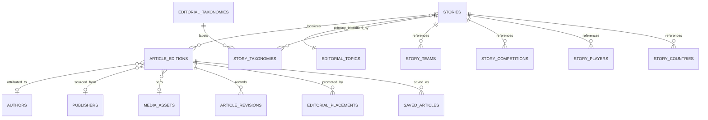
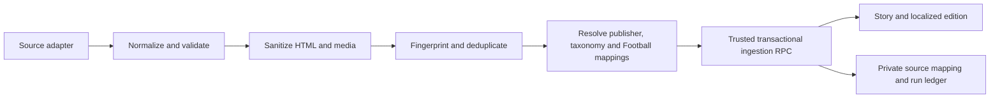

# BotolaGO V2 — News and Editorial Content Domain Plan

Status: Phase 4 implementation contract

Branch: `backend/news-domain`

Authority: BotolaGO Production V2 only

## Executive decision

BotolaGO News uses a canonical **story plus localized article editions** model. A story carries shared origin, priority, taxonomy, and canonical Football relationships. Each French or Arabic edition owns its title, slug, body, publication workflow, SEO metadata, media caption, and search document. This avoids duplicating one football story while preserving independent editorial control for each language.

Canonical and operational data remains in non-exposed `app` and `app_private` schemas. Browser reads and owner-safe saved-article mutations use bounded `api` RPCs. Editorial and ingestion mutations use narrowly granted RPCs with database-enforced role checks. Provider HTML is never stored or returned before server-side sanitization.

No live news source is selected in Phase 4. The phase supplies a complete provider contract, deterministic fixture adapter, validation, sanitization, deduplication, ingestion runner, and trusted persistence boundary without representing fixtures as a live integration.

## 1. Frontend dependency map

### Current routes and modules

| Consumer                    | Current dependency                   | Current assumption                                             | V2 contract                                                                                                                   |
| --------------------------- | ------------------------------------ | -------------------------------------------------------------- | ----------------------------------------------------------------------------------------------------------------------------- |
| Home lead story             | `botolaService.getLeadArticle()`     | One locally flagged `isLead` article                           | `news_home_modules(language)` resolves active language-aware placements                                                       |
| Home followed-club stories  | Entire mock article list             | Category `latest`; followed clubs are separately mocked        | Home RPC derives followed canonical team UUIDs when authenticated and safely falls back to latest                             |
| News default tab            | Entire mock article list             | `for_you` means all articles except lead                       | Bounded feed; followed-team relevance for authenticated users, deterministic latest fallback otherwise                        |
| News category tabs          | Client filtering                     | Hardcoded `latest`, `transfers`, `analysis`, `interviews` enum | Taxonomy slugs returned by backend; compatibility maps current tabs without hardcoding database identities                    |
| News club filters           | Mock club array and `clubIds[]`      | Provider-like string IDs such as `war`                         | Canonical Phase 3 team UUID filters and team summary DTOs                                                                     |
| Follow toggle inside filter | Component-local state                | Lost on reload; not authoritative                              | Existing Phase 2 followed-team repository; Phase 4 does not create a second follow system                                     |
| Lead/top/latest sections    | Client slicing and sorting           | Top three and latest five from one array                       | Placement and feed read models determine ordering and bounds                                                                  |
| Saved section               | `useSavedArticles()` local storage   | Device-local IDs such as `a1`; no ownership                    | Canonical `saved_articles(user_id, article_edition_id)` with owner RPCs and cursor feed                                       |
| Article cards               | `Article` localized object           | Both languages bundled; CSS gradient instead of media          | Language-explicit DTO adapted to frozen card props; validated media URL or deterministic gradient fallback                    |
| Article detail              | Fetch all and `.find(id)`            | Route parameter is a mock ID                                   | Direct UUID-or-language-slug detail RPC; current ID route remains compatible                                                  |
| Article body                | `buildBody()` generates paragraphs   | Excerpt is expanded into fake copy                             | Sanitized backend `bodyHtml`; the fake-body helper is removed                                                                 |
| Related articles            | Client category/team intersection    | First three, no language/status protection                     | Deterministic backend score across taxonomy, Football entities, priority, and recency                                         |
| Author/source               | Localized display-name object only   | No publisher or attribution model                              | Explicit author and publisher DTOs; private licensing/source configuration omitted                                            |
| Publication time            | Relative/full-date helpers           | ISO timestamp present; no update timestamp                     | Published/updated timestamps remain ISO and language-safe                                                                     |
| Search                      | No News route or repository          | Only a generic translation key exists                          | Production PostgreSQL FTS repository/API ready for future UI integration                                                      |
| Breaking state              | Notification preference only         | No article state or placement                                  | Time-bounded `breaking` placement; no notification delivery in Phase 4                                                        |
| Loading/empty/error         | Query skeletons and empty sections   | No stable domain errors; detail has not-found UI               | Preserve skeleton/empty/not-found states and map stable News errors to route error boundaries                                 |
| RTL/localization            | `I18nProvider` and localized objects | `tr()` may fall back to French                                 | Repository requests exactly the active language; missing editions return empty/not-found, never silent cross-language content |
| Pagination                  | None                                 | Entire article collection fetched repeatedly                   | Keyset cursors for feeds, search, saved content, and source ingestion                                                         |

### Existing data and legacy assumptions

- `src/integrations/supabase/types.ts` contains legacy `articles`, `article_clubs`, and `saved_articles` shapes. They are archive-only and must not be imported by V2 News code.
- `src/mocks/data.ts` contains five bilingual mock records with IDs `a1`–`a5`, category strings, team-like strings, gradients, and generated timestamps. These describe visible behavior only.
- `src/services/mock.ts` is a monolithic mixed-domain mock service. Phase 4 introduces a News repository boundary while retaining deterministic preview data.
- `src/lib/saved-articles.ts` explicitly declares itself transitional. Its local key is not production authority and non-UUID records cannot be copied into the canonical database.
- News routes use React Query client calls rather than route loaders/server functions. V2 keeps route components query-oriented but removes all direct data assembly and Supabase access.
- Article detail and Match detail currently derive related News by scanning all mock articles. Phase 4 cuts over News routes and Home only; Match/Fantasy consumers remain behind their existing boundary until their owning phase permits integration.

## 2. Canonical article model



`stories` is the canonical event/editorial identity. It owns content origin, priority, shared taxonomy/Football relationships, first/last publication times, and lifecycle timestamps. It never contains localized copy.

`article_editions` owns exactly one edition per `(story_id, language)` and a unique `(language, slug)`. It stores title, optional subtitle, excerpt, sanitized body HTML, optional authored Markdown, body format, author/publisher/media references, source/canonical URL, SEO description, status, visibility, scheduled/published timestamps, reading time, sanitization version, and freshness metadata.

Bodies use typed formats:

- `sanitized_html`: only sanitized HTML is persisted;
- `markdown`: source Markdown may be retained for trusted editorial revisions, but the published/client body is still sanitized HTML.

Raw provider HTML is never canonical and never returned by an API.

## 3. Localization model

- `app.language_code` remains the closed Phase 2 enum (`fr`, `ar`) for current first-class editions.
- French and Arabic editions have independent slugs, status, schedule, publication time, SEO metadata, captions, bodies, and search documents.
- A story may have one edition, both editions, or neither while being drafted.
- Feed/detail/search functions require an explicit language and never fall back to another edition.
- Taxonomy labels use `editorial_taxonomy_translations(taxonomy_id, language)` rather than JSON.
- Author names are canonical human/publisher attribution, not translated copies. Optional localized bios are deferred until a visible requirement exists.
- Future English requires adding a reviewed language enum value and edition; it does not require duplicating stories or redesigning relationships.

## 4. Taxonomy model

`editorial_taxonomies` normalizes categories, topics, and tags with stable slugs, active state, and display order. `editorial_taxonomy_translations` supplies French/Arabic labels. `story_taxonomies` provides the many-to-many relation and can mark a primary classification.

Football context uses dedicated relation tables to canonical Phase 3 entities:

- `story_competitions`
- `story_teams`
- `story_players`
- `story_countries`

No team, competition, player, or country is duplicated in News. All relation tables have composite primary keys and reverse indexes for filtered feeds and related-content ranking.

Current UI category tabs map to taxonomy slugs. `for_you` and `latest` are feed modes, not taxonomy records.

## 5. Source/provider abstraction

The source interface supports capabilities for recent listings, article detail, corrections/withdrawals, cursor pagination, rate-limit metadata, and freshness/version metadata. Normalized provider DTOs include external ID, canonical URL, language, title/summary/body, author, publication/update times, media, taxonomy hints, and correction state.

Provider payloads stay inside `src/backend/news/provider`. Zod validates every normalized DTO. A deterministic fixture adapter drives tests and previews. Live provider selection requires documented evaluation of Moroccan-football coverage, French/Arabic availability, correction semantics, latency, quota, legal reuse, attribution, media rights, and uptime.

## 6. Editorial workflow

Closed states:

```text
draft -> in_review
in_review -> draft | rejected | scheduled | published
scheduled -> draft | published | unpublished | archived
published -> unpublished | archived
unpublished -> draft | published | archived
rejected -> draft | archived
archived -> draft (administrator recovery only)
```

- Editors create/update drafts and submit/revise content.
- Publishers approve, schedule, publish, unpublish, archive, reject, and manage placements.
- Administrators can perform all editorial actions and recover archived content.
- Ingestion service creates/updates external drafts or eligible published content through service-role-only RPCs.
- Every sensitive mutation creates an append-only editorial event and a typed revision snapshot. Ordinary users receive no editorial execution grants.

## 7. Ingestion architecture



Jobs are discrete capabilities: sync feeds, fetch details, normalize, validate, sanitize, resolve taxonomy, deduplicate, persist editions, process media, publish eligible content, apply corrections, and withdraw/archive. The shared runner is paginated, checkpointed, idempotent, retry-budgeted, rate-limit-aware, partial-failure-safe, and observable. No production cron is activated.

## 8. Deduplication strategy

Signals are evaluated in descending confidence:

1. `(publisher/source, external_article_id)` — authoritative idempotency key.
2. Normalized canonical URL within a publisher — exact source duplicate.
3. Same publisher, language, content fingerprint, and publication window — exact-content duplicate.
4. Cross-publisher fingerprint/title/entity similarity — recorded as a candidate only; never automatically merged.
5. Explicit translation link — both editions attach to one story through a trusted mapping/override.

Private source mappings preserve source update time/version and reject stale updates. Duplicate decisions record signal, confidence, selected story/edition, resolution, actor, and sanitized metadata. Corrections update the mapped edition and create a revision rather than a duplicate. Similar titles alone never merge stories.

## 9. Sanitization strategy

External HTML is sanitized server-side with a pinned, well-maintained allowlist library. The policy permits editorial paragraphs, headings, lists, blockquotes, emphasis, safe links, and approved images. It removes scripts, styles, forms, event handlers, unsafe iframes/embeds, `javascript:`/`data:` URLs, unknown attributes, and comments. External links receive `rel="noopener noreferrer nofollow"` and safe targets.

The sanitizer validates URL protocols and optional media-domain allowlists, produces a versioned sanitized HTML string, and rejects empty/unsafe output. Database checks provide defense in depth against script tags, inline event handlers, and dangerous URL schemes. The frontend renders only `bodyHtml` returned by the controlled API; raw provider HTML is never persisted or exposed.

## 10. Search strategy

PostgreSQL full-text search is sufficient for the current scale and avoids premature external infrastructure. Each edition has a derived `article_search_documents` row containing a weighted `tsvector`:

- A: title and subtitle
- B: excerpt, author, publisher
- C: taxonomy and Football entity names
- D: sanitized article body

French uses the PostgreSQL `french` configuration plus `unaccent`. Arabic uses `simple` tokenization after immutable normalization of diacritics, tatweel, alef variants, alif maqsura, and whitespace. The same normalization is applied to queries. A GIN index supports matching. Search ranks by `ts_rank_cd`, editorial priority, and bounded recency weight, then uses published time and UUID for deterministic ties/keyset pagination.

All public search paths enforce language, `published`, `public`, `published_at <= now()`, and soft-availability rules. Category/topic/team/competition/player filters use indexed relation tables. The API accepts bounded queries and never uses naive wildcard `LIKE` scans.

Limitations: Arabic morphology is not stemmed by PostgreSQL `simple`; synonym/transliteration support and typo tolerance may later justify PGroonga, ParadeDB, or a dedicated search engine after measured evidence.

Reference: [Supabase PostgreSQL Full Text Search](https://supabase.com/docs/guides/database/full-text-search).

## 11. Read-model strategy

Only `api` is exposed through PostgREST. DTO-focused RPCs return complete bounded payloads:

- `news_home_modules`: active lead/featured placements, latest, and followed-team stories.
- `news_feed`: language, feed mode, taxonomy and Football filters, keyset cursor.
- `news_article_detail`: edition, author, publisher, media, taxonomy, Football context, and current-user save state.
- `news_related_articles`: deterministic language-safe ranking.
- `news_saved_articles`: owner-only visible saved feed with cursor.
- `news_search`: indexed FTS with filters and stable cursor.
- `news_taxonomies`: active localized categories/topics.
- `news_save_article` / `news_unsave_article`: idempotent owner mutations deriving `auth.uid()`.

Public DTO helpers expose no revision, moderation, ingestion, source credentials, private licensing notes, role membership, or raw source payload. Route components never assemble relation graphs or issue scattered Supabase queries.

## 12. RLS and role model

- Every Phase 4 `app` and `app_private` table has RLS enabled and forced.
- Browser roles have no direct canonical/private table privileges; public reads use individually granted RPCs.
- `saved_articles` carries owner-select/insert/delete RLS as defense in depth, while public mutation remains RPC-only.
- `app_private.editorial_memberships` stores server-controlled `editor`, `publisher`, or `administrator` membership, grant/revoke attribution, and active state. Client metadata is never trusted.
- Editorial RPCs derive the authenticated user and consult protected membership. Role hierarchy is checked in the database.
- Ingestion RPCs are executable only by `service_role` and still do not grant direct table writes.
- Break-glass membership changes require a reviewed service-role operation and are audit logged.

This follows Supabase's two-layer model: explicit grants control API reachability; RLS controls rows. It also accounts for the April 2026 change that makes table/function exposure opt-in. References: [Securing the Data API](https://supabase.com/docs/guides/api/securing-your-api), [2026 explicit-grants change](https://supabase.com/changelog/45329-breaking-change-tables-not-exposed-to-data-and-graphql-api-automatically).

## 13. Media strategy

Phase 4 generalizes the existing `app.media_assets` table instead of creating a duplicate media identity. It adds editorial media kinds and optional dimensions, MIME type, alt text, caption, credit/copyright owner, license/attribution URLs, while preserving every Football row and constraint.

- Licensed remote media may remain a validated HTTPS reference.
- Approved cached copies use a dedicated public-read `editorial-media` bucket and `news/...` paths.
- Browser uploads are forbidden; trusted server/editorial workflows own writes.
- Public object access does not imply bucket listing or upload rights.
- Media without documented reuse rights remains remote or rejected; Phase 4 does not copy third-party binaries.
- Cards/detail use deterministic visual fallbacks when no approved media exists.

Storage policies remain least privilege and never expose service keys. Reference: [Supabase Storage access control](https://supabase.com/docs/guides/storage/security/access-control).

## 14. Frontend cutover plan

1. Add provider-independent News DTOs and repository interfaces.
2. Preserve a deterministic bilingual mock repository using canonical UUIDs.
3. Add a Supabase implementation that validates every API response with Zod.
4. Add `VITE_NEWS_DATA_MODE=mock|supabase`; missing production configuration fails closed.
5. Replace Home editorial, News feed, and Article detail mock calls with the News service.
6. Replace fake detail body generation with sanitized `bodyHtml`.
7. Replace local saved authority with authenticated canonical saves in Supabase mode; retain device-local behavior only in explicit mock/preview mode.
8. Include language in every News query key so switching French/Arabic fetches the matching edition.
9. Preserve current cards, layout, loading, empty, not-found, RTL, and visual tokens.
10. Do not cut over Match, Football, Fantasy, Notifications, or Admin UI consumers.

## 15. Test strategy

Database tests cover schema/constraints, edition/slug uniqueness, transitions, placements, taxonomy and Football relations, dedupe/stale correction, search vectors and French/Arabic results, related ranking, saved ownership, grants, editorial roles, ingestion service access, and public draft exclusion.

Application tests cover DTO parsing, explicit mode selection, deterministic mock behavior, source normalization, sanitizer allow/deny policy, fingerprints, status transitions, retries/checkpoint resume, duplicate/correction decisions, repository cursors, language isolation, and compatibility adapters.

Tests use deterministic sanitized fixtures only and never call a live source or production project.

## 16. Migration plan

1. `news_editorial_catalog`: media generalization, stories/editions, authors/publishers, taxonomy, Football relations, revisions, placements, saved articles, RLS, triggers, indexes.
2. `news_search_ingestion`: FTS normalization/documents, provider source mappings, duplicate decisions, ingestion runs/rejections, editorial roles/events, stale-write helpers.
3. `news_api_security`: DTO helpers, public feeds/detail/search/related/taxonomy, saved owner RPCs, editorial workflow RPCs, service-role ingestion RPCs, explicit grants.
4. `news_storage_index_hardening`: trusted editorial bucket policy, foreign-key coverage, query-path/partial indexes, comments and advisor hardening.

All migrations are additive, zero-replayable, non-destructive to V2 data, and independent of legacy schema/history. Production and legacy receive no Phase 4 migrations before review.

## 17. Risks and rollback

### Risks

- No production source contract, content license, or media license is approved.
- Sanitizer policy must be re-reviewed whenever supported embeds or HTML elements expand.
- Arabic `simple` FTS has limited stemming and typo tolerance.
- Editorial membership administration has no UI in this phase and requires trusted operational tooling.
- Existing local saved IDs are mock strings and cannot safely map to canonical UUIDs without an explicit deterministic preview mapping.
- Home personalization requires authenticated Phase 2 follows; anonymous users receive a deterministic latest fallback.
- Phase 4 is stacked on open Phase 3 and Phase 2 pull requests until their merge order is resolved.

### Rollback

1. Keep or restore `VITE_NEWS_DATA_MODE=mock` to stop V2 News reads and writes.
2. Stop local/staging ingestion invocations; no production cron exists.
3. Revert the Phase 4 application commit to restore the transitional mock/local behavior.
4. Do not run destructive down SQL on a shared environment. Before any editorial data exists, recreate disposable staging from reviewed prior migrations if required.
5. After data exists, export stories, editions, mappings, revisions, taxonomy, and saved ownership, then use reviewed forward correction migrations.
6. Production V2 and legacy need no rollback because Phase 4 does not modify them before review.

## Phase boundary and exact next recommendation

Phase 4 ends after canonical News schema, localization, taxonomy, source abstraction, ingestion/sanitization/deduplication, search, related/featured content, editorial backend roles/workflow, saved articles, API read models, News/Home cutover, tests, staging validation, and draft PR delivery.

Phase 5 should begin only after Phase 2–4 merge order is resolved, News staging roles and source licensing are reviewed, and a provider is selected. The exact recommendation is **Phase 5 — Production Notifications and Delivery Infrastructure**: event/outbox model, user notification preferences, push/email/in-app delivery adapters, idempotency, rate limits, retries/dead-letter handling, quiet hours/localization, security/RLS, and staging-only scheduling. Do not begin Fantasy expansion, Admin CMS UI, analytics dashboards, or production deployment in Phase 5.
