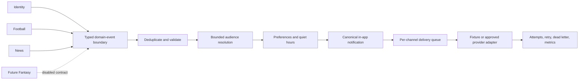

# Phase 5 — Notifications and Delivery Domain Plan

## Status and phase boundary

This document is the required pre-migration audit and target design for the
greenfield BotolaGO V2 Notifications domain. It was completed before any Phase
5 schema migration was created.

Phase 5 owns notification intent, user eligibility, preference enforcement,
localization, fan-out, scheduling, channel delivery state, retry/dead-letter
handling, safe device registration, and operational visibility. It does not
own Football match state, News publication decisions, Identity security
decisions, or future Fantasy calculations. Production push, email, and cron
remain disabled until separately approved.

The legacy Supabase project and archived migrations are not inputs to this
design and must remain untouched.

## 1. Frontend dependency map

### Current implemented surface

| Product surface              | Current contract                                               | Current authority                                            | Phase 5 action                                                                                    |
| ---------------------------- | -------------------------------------------------------------- | ------------------------------------------------------------ | ------------------------------------------------------------------------------------------------- |
| Onboarding notification step | Three booleans: match alerts, breaking news, Fantasy deadlines | `app.user_preferences` through Phase 2 `complete_onboarding` | Reuse as canonical event-group defaults; preserve the atomic onboarding RPC                       |
| Profile notification summary | Shows enabled count as `n/3`                                   | Auth profile DTO                                             | Preserve frozen UI and DTO compatibility                                                          |
| Profile preference rows      | Read-only ON/OFF display                                       | Auth profile DTO                                             | Keep server-authoritative values; expose a dedicated Notifications repository for future controls |
| Preferred language           | `fr` or `ar`                                                   | `app.profiles.preferred_language`                            | Reuse for template selection; copy language onto each notification at render time                 |
| Favorite/followed teams      | Canonical Football UUID relations                              | Phase 2/3 tables                                             | Eligible audience input for supported Football events                                             |
| Followed competitions        | Canonical Football UUID relations                              | Phase 2/3 table                                              | Eligible audience input for Football/News events                                                  |
| News saves/follows           | Canonical saved articles plus story/Football links             | Phase 4                                                      | Saved articles do not imply notification consent                                                  |
| Home Fantasy alerts          | Static/mock player-availability cards                          | Mock Fantasy state                                           | Not a Notification Center and not cut over in Phase 5                                             |

### Missing frontend surfaces

There is currently no Notification Center route, unread badge, notification
filter, mark-read interaction, deep-link notification card, device management
UI, service worker, Web Push subscription flow, native mobile bridge, push
permission flow, or email-notification settings screen. No frontend source
currently contains push tokens or production email-provider assumptions.

Phase 5 therefore creates stable repositories and DTOs for those capabilities
without redesigning or inventing UI. The only visible cutover is the existing
onboarding/profile preference slice. Preview and deterministic tests retain an
explicit mock adapter. Production configuration fails closed.

### Existing localization and routing assumptions

- UI languages are French and Arabic; RTL is controlled by the existing i18n
  provider.
- Current entity routes include match detail, article detail, Fantasy routes,
  and profile/settings. Notification deep links must map to typed internal
  targets, never arbitrary URLs.
- Current route data uses explicit loading, error, and empty states. Repository
  contracts must preserve these states when a Notification Center is added.
- UUIDs are canonical for Identity, Football, and News. Device IDs supplied by
  a client are validated opaque identifiers, while database row IDs remain
  UUIDs.

## 2. Domain boundaries and event ownership

Source domains decide facts. Notifications receives a stable fact envelope and
decides which users and channels are eligible. It never recomputes a match
status, article publication state, Fantasy points, or Identity security state.

Initially supported source events are limited to facts already available:

- Identity: `password_changed`, `account_deletion_requested`,
  `account_deletion_cancelled`, and `sensitive_profile_change`.
- Football: `match_starting`, `match_started`, `goal`, `half_time`,
  `full_time`, `lineup_available`, `match_postponed`, and `match_cancelled`.
- News: `breaking_news`, `followed_team_article`, and
  `followed_competition_article`.
- Fantasy event names and schemas may be declared as disabled contracts only.
  No Fantasy audience resolution or event production is implemented before an
  authoritative Fantasy domain exists.

Domain services call a trusted event-ingestion boundary. Notification workers
do not depend on public table triggers. A narrowly documented transactional
Identity bridge may emit supported security events from the existing trusted
security audit writer because it is already the authoritative decision point;
all other producers remain explicit service calls.

## 3. Canonical entity model

### `app`

- `notification_templates`: immutable versioned French/Arabic, channel-specific
  title/body templates, required variables, length constraints, active state,
  and audit timestamps. Browser roles cannot write them.
- `notifications`: one localized, rendered, user-owned in-app record with
  category/type, priority, typed deep-link columns, source references,
  availability/expiry/read/dismiss/archive timestamps, and event linkage.
- `notification_deliveries`: one channel state per notification and channel.
  Public DTOs expose only a coarse optional delivery state, never provider IDs
  or failures.
- `device_registrations`: safe user-owned device summary: device identifier,
  platform/provider, locale, timezone, app version, enabled/last-seen and
  invalidation timestamps. Raw push destinations are not stored here.
- `notification_subscriptions`: explicit normalized match/team/competition/news
  topic subscriptions using typed target columns and an exactly-one-target
  constraint. No arbitrary JSON arrays.
- Phase 2 `user_preferences`: remains the only user-default preference source.
  Add global/channel switches, timezone, quiet hours, digest mode, and reminder
  timing. Existing `match_alerts`, `breaking_news`, and
  `fantasy_deadline_reminders` remain canonical event-group switches for
  backwards compatibility.

### `app_private`

- `notification_events`: validated event envelope, safe bounded payload,
  deduplication key, schema version, processing status, correlation ID, and
  timestamps.
- `notification_fanout_runs`: bounded audience checkpoint, counters, lock,
  retry, and sanitized failure state.
- `notification_schedules`: UTC due time, timezone basis, cancellation,
  claim/lease, retry, and idempotency fields.
- `push_destinations`: raw push destination associated with a device, isolated
  from all browser reads. A digest supports uniqueness and rotation.
- `notification_delivery_attempts`: immutable attempt ledger with retryability,
  provider latency/quota metadata, sanitized errors, and no full destinations.
- `notification_dead_letters`: terminal failures and trusted replay state.
- `notification_operational_audit`: append-only template, replay, registration,
  preference, schedule, and delivery security events.

Core relational state is not stored as JSON. A bounded JSON object is justified
only for versioned event variables, rendered template variables, and sanitized
provider metadata because those are typed at the TypeScript/validation
boundary and vary by event/provider.

## 4. Preference model

`app.user_preferences` is extended instead of duplicated. Defaults are:

- notifications globally enabled;
- in-app enabled;
- push and email disabled until a user explicitly enables a configured channel;
- match alerts, breaking news, and Fantasy deadline reminders retain the Phase
  2 defaults;
- timezone `Africa/Casablanca` when absent;
- quiet hours disabled, with optional local start/end times;
- immediate delivery by default;
- a 24-hour Fantasy reminder default, retained but inactive until Fantasy emits
  authoritative events.

The database validates timezone names, quiet-hour completeness, midnight
crossing, and reminder bounds. All timestamps persist in UTC. Quiet-hour
calculation converts the candidate delivery time into the user timezone and
delays non-urgent delivery until the next local quiet-hour boundary. Missing
timezone uses the explicit Casablanca default, never the database session
timezone.

Mandatory account/security types ignore optional category and channel opt-outs
for in-app delivery and may bypass quiet hours. Email still requires a verified
address and an approved/configured email provider. Mandatory bypasses are
enumerated, not inferred from arbitrary priority values.

## 5. Template and localization strategy

Templates are addressed by `(template_key, channel, language, version)` and
have one active version per combination. Required variable names are stored as
a constrained text array. Rendering rejects missing or unknown variables.
HTML email uses a narrow escaped placeholder renderer and an approved template
body; push/in-app output is plain text with channel length checks.

French and Arabic are first-class and must both exist before a template family
can be activated for production. There is no silent French fallback for Arabic.
Arabic templates are authored with appropriate punctuation; direction is a DTO
field derived from language. Notifications preserve the selected language and
rendered copy so later profile-language changes do not mutate history.

## 6. Stable event envelope

Every event contains:

- UUID event ID;
- stable event type and source domain;
- optional canonical source entity UUID;
- occurred-at timestamp;
- positive schema version;
- safe payload validated by an event-specific Zod schema;
- stable deduplication key;
- correlation UUID;
- optional directly affected user for Identity events.

The unique deduplication key prevents duplicate source events. Unsupported
schema versions, invalid domains, oversized payloads, secrets, raw provider
payloads, and unknown types are rejected before persistence. Stable internal
errors replace raw PostgreSQL, Supabase, and provider messages.

## 7. Fan-out, idempotency, and concurrency

Audience resolution uses database-side keyset batches and checkpointed fan-out
runs. Each batch is bounded and transactionally claimed with `FOR UPDATE SKIP
LOCKED`. The worker applies subscriptions, canonical follows, category/type
preferences, channel switches, verified-email requirements, and quiet hours
before inserting notifications/deliveries.

Uniqueness on `(event_id, user_id)` prevents duplicate user notifications.
Uniqueness on `(notification_id, channel, device_registration_id)` (with
nulls treated as equal) prevents duplicate channel destinations while
preserving independent multi-device push delivery.
Every schedule and provider attempt has a stable idempotency key. Compare-and-
set status transitions and expiring leases prevent concurrent workers from
double-processing work. Partial failure records progress and resumes at the
last user UUID rather than restarting the audience in memory.

## 8. Scheduling and timezone behavior

Schedules are one-shot records. Recurring business logic creates or updates
bounded one-shot schedules; it is not hidden in a massive cron function.
Claiming is atomic, ordered by `(due_at, id)`, bounded, and supports stale-lock
recovery. Cancellation and rescheduling use expected-version checks.

Supabase Cron may later invoke small claim/dispatch workers, but no production
job is created in Phase 5. Current Supabase guidance recommends bounded cron
work and no more than eight concurrent jobs; the design therefore separates
fan-out and delivery batches. Edge Functions remain short-lived orchestrators,
not durable job state. Durable state and checkpoints remain in PostgreSQL.

Timezone tests cover midnight crossings and daylight-saving zones even though
Morocco is the default. UTC is the sole persistence basis.

## 9. Provider abstraction and delivery policy

Provider-neutral interfaces exist for in-app, push, and transactional email:

- `send` and optional bounded `sendBatch`;
- provider message ID;
- retryability classification;
- invalid-destination detection;
- rate-limit/quota metadata;
- timeout and abort signal;
- stable error code.

Deterministic fixture adapters test success, timeout, 429, 5xx, invalid token,
invalid email, template failure, and permanent failure. Production adapters
are disabled and fail closed until a provider, credentials, privacy terms, and
operational owner are approved. Supabase Auth remains responsible for its own
verification/reset emails; product notifications use the separate email
boundary.

Retryable failures use bounded exponential backoff with jitter and a maximum
attempt count. Permanent failures dead-letter immediately. Invalid push tokens
disable the destination. Retry budgets and provider concurrency limits prevent
storms. Dead-letter replay is trusted-only, explicit, audited, and idempotent.

## 10. Device registration and privacy

Authenticated RPCs register, rotate, update, disable, unregister, and list safe
device summaries. A device cannot be reassigned across users merely by knowing
its ID or token. Token rotation proves ownership through the authenticated
registration operation and replaces the private destination transactionally.
Raw tokens never appear in views, logs, DTOs, generated browser queries, or
operational errors.

Logout-current-device invalidation is supported by device ID when a client
integration exists; global logout can invalidate all devices through trusted
account-security orchestration. Multi-device registrations are independent.

Retention targets:

- in-app notifications: 180 days after creation or 30 days after archive;
- delivery attempts: 90 days;
- safe event payloads and fan-out runs: 30 days after completion;
- invalidated device destinations: delete within 7 days;
- dead letters: 90 days unless under active incident review;
- operational/security audit: 365 days;
- templates and minimal delivery aggregate facts: retained while referenced.

Account deletion removes or anonymizes user notifications, devices,
subscriptions, preferences, and destinations through existing FK lifecycle;
security records retain only the minimum policy-required identifiers.

## 11. Deep-link model

Deep links are typed columns: target kind plus canonical entity ID where
required. Allowed targets are match detail, article, profile/settings, security
action, and disabled future Fantasy destinations. Validation constructs known
application routes in the repository layer. No arbitrary URL, scheme, host,
query string, or redirect target is persisted. Missing, expired, or
unauthorized entities produce a safe unavailable state rather than redirecting
outside BotolaGO.

## 12. RLS, grants, and API surface

Every Phase 5 table enables and forces RLS.

- `app` and `app_private` stay outside the Data API exposure list.
- Browser roles receive no direct canonical/private table grants.
- Authenticated users access owner-bounded `api` RPCs for list, unread count,
  mark read/unread, mark all read, dismiss/archive, preferences, subscriptions,
  and safe device summaries.
- Users cannot create notifications, enqueue delivery, mutate templates or
  delivery status, access destinations/provider IDs, replay dead letters, or
  invoke bulk fan-out.
- Trusted worker RPCs validate a server/service context and have explicit
  grants only to `service_role`; `PUBLIC`, `anon`, and `authenticated` execution
  is revoked.
- Security-definer functions live in the controlled `api` or private schema,
  set an empty search path, schema-qualify every object, validate caller/owner,
  and explicitly revoke default `PUBLIC` execution.
- No Phase 5 table is added to Realtime. Realtime may later carry owner-scoped
  freshness hints only after a separate security/load review.

The exposed API provides keyset-paginated notification cards, bounded category
filters, unread count, state transitions, atomic preference updates, and device
operations. Operational metrics are private trusted RPCs only.

## 13. DTO and repository strategy

Provider-independent Zod DTOs cover notification card, page/cursor, unread
count, preference group, deep-link target, safe device summary, channel state,
event envelope, template render input, schedule, and provider result. Explicit
nullability and stable enum values are mandatory.

`NotificationRepository` owns list/count/read/dismiss operations.
`NotificationPreferenceRepository` owns defaults and atomic updates.
`DeviceRegistrationRepository` owns safe registration lifecycle.
Server-only services own event ingestion, fan-out, scheduling, dispatch,
webhook validation, and dead-letter replay. Route components never contain
scattered Supabase calls.

`VITE_NOTIFICATIONS_DATA_MODE=mock|supabase` selects frontend repositories.
Development may default to deterministic mock; production without explicit
`supabase` mode fails closed. Push/email provider variables are server-only and
never prefixed with `VITE_`.

## 14. Observability and error contracts

Structured metrics include received/duplicate/rejected events, audience size,
notifications created, deliveries queued/sent/failed, retry/dead-letter counts,
provider latency/rate limits, invalid destinations, bounce/complaint outcomes,
schedule lag, and fan-out duration. Logs use the existing redacting structured
logger and never contain tokens, authorization headers, raw email addresses,
credentials, or full payloads.

Stable errors include:

- `notification_not_found`, `notification_access_denied`,
  `invalid_notification_preference`;
- `invalid_device`, `device_token_conflict`, `invalid_deep_link`;
- `template_not_found`, `template_variable_missing`;
- `delivery_provider_unavailable`, `delivery_rate_limited`,
  `delivery_permanently_failed`;
- `notification_duplicate`, `event_schema_unsupported`, `schedule_conflict`,
  `quiet_hours_invalid`, `email_unverified`, `push_not_configured`, and
  `notification_channel_disabled`.

## 15. Performance and indexing

Primary access paths receive explicit indexes:

- user feed `(user_id, created_at desc, id desc)` with active/archived partial
  variants;
- unread count partial index by user;
- event deduplication and pending status;
- due schedules and retryable deliveries by next-attempt timestamp;
- fan-out checkpoint/lease recovery;
- device owner summaries and private token digest uniqueness;
- subscription target-to-user reverse lookups;
- templates by key/channel/language/active version;
- attempts/dead letters by operational status and age.

Feeds use keyset pagination and bounded limits. Fan-out and dispatch use bounded
claims. No route performs N+1 delivery or template queries. Representative
volume `EXPLAIN (ANALYZE, BUFFERS)` checks are required in staging before
production scheduling. Redis is not justified until measured database/worker
contention exceeds these indexed queues and batched claims.

## 16. Testing strategy

Database/pgTAP and RLS tests cover clean replay, constraints, defaults,
uniqueness, indexes, claims, stale locks, retention, owner reads and mutations,
cross-user/anonymous denial, private isolation, and trusted-worker access.

TypeScript tests cover envelope validation/versioning, event deduplication,
audience filters, preference rules, quiet hours, mandatory security bypass,
batch resume, template rendering/escaping/lengths, deterministic provider
success/failures, backoff/circuit breaking, invalid-token cleanup,
dead-letter/replay, schedule timing/cancellation, deep links, DTO compatibility,
mock parity, and fail-closed production behavior. Tests never call a live push
or email provider.

CI extends the existing application/database gates to run notification unit and
integration tests, Edge Function static validation if functions are added,
migration replay, pgTAP/RLS, database lint, generated-type drift, secret scan,
typecheck, lint, tests, and build.

## 17. Environment and deployment strategy

Sanitized environment placeholders cover data mode, provider selection,
credentials, app/deep-link base, concurrency, timeouts, retries, schedule batch,
retention, webhook secrets, and fixture/staging/production modes. Credentials
remain Supabase secrets or deployment secrets and are never committed.

Phase 5 migrations are additive, replayable from zero, explicitly granted,
indexed, and validated locally before application to V2 staging. Production V2
is not changed. No production provider, Edge Function, webhook, email, push, or
cron is activated from this branch. Staging uses fixture adapters and manual
trusted invocations only.

## 18. Migration and frontend cutover plan

1. Extend `app.user_preferences` with canonical notification defaults while
   preserving Phase 2 columns and RPC compatibility.
2. Create templates, notifications, deliveries, safe devices, subscriptions,
   private events, fan-out/schedules, destinations, attempts, dead letters, and
   operational audit.
3. Enable/force RLS, revoke direct access, and add explicit owner/trusted RPCs.
4. Seed only deterministic French/Arabic system templates required for tests;
   no marketing content or live provider configuration.
5. Implement typed event/template/provider/queue services and fixture adapters.
6. Add frontend repositories and preserve the existing three-toggle auth DTO.
7. Regenerate V2 database types and enforce drift CI.
8. Replay from zero, run pgTAP/RLS and application gates, review query plans,
   then validate only on V2 staging.
9. Push `backend/notifications-domain` and open a draft PR to `main` without
   enabling production delivery or schedules.

## 19. Risks and rollback

- The frozen frontend has no Notification Center or push permission UI; Phase 5
  supplies backend contracts without claiming a complete visible center.
- No push or transactional-email provider is approved. Fixture adapters are
  not production delivery.
- Web Push versus native provider selection depends on a future mobile/PWA
  architecture decision.
- Email bounce/complaint webhooks require provider-specific signature review.
- Morocco timezone rules and global DST behavior require periodic tzdata
  currency and deterministic regression tests.
- Large breaking-news audiences need representative staging load tests before
  any production worker cadence is approved.

Rollback keeps the additive schema dormant: set notification data mode to mock,
stop manual workers, revert application code, and do not execute destructive
down SQL. Before real staging data, the disposable staging project can replay
the last reviewed migration set. After data exists, use export plus a reviewed
forward repair. Production and legacy require no rollback because neither is
modified in Phase 5.
