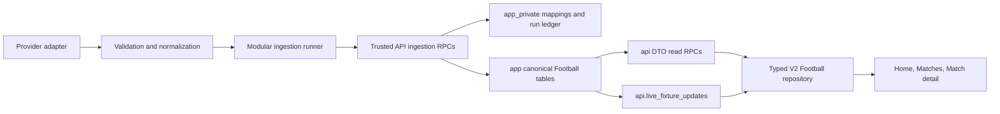

# Phase 3 — Canonical Football Data Domain

## Outcome

Phase 3 establishes a provider-independent, server-authoritative Football domain for BotolaGO V2. It adds the canonical catalog and match model, trusted provider mapping and ingestion boundaries, bounded public read APIs, controlled live updates, frontend repositories, deterministic adapters, and database/application security tests. No production cron, production deployment, News work, or Fantasy expansion is included.

The detailed frontend audit and design are in `FOOTBALL_DOMAIN_PLAN.md`; operating and rollback procedures are in `FOOTBALL_OPERATIONS_RUNBOOK.md`.

## Architecture summary

- Internal UUIDs are authoritative. Provider identifiers exist only in `app_private.football_provider_mappings`.
- Provider payloads are validated into normalized DTOs before trusted persistence and never appear in public DTOs.
- Canonical `app` and operational `app_private` schemas are not browser API schemas. Browser access is through bounded `api` RPCs and a sanitized live projection only.
- Canonical Football tables are forced-RLS and server-write-only. Public reads use narrow `security definer` functions with fixed empty search paths and explicit grants.
- Volatile fixtures use provider freshness, source sequence/version, terminal-state protections, and an idempotent provider mapping to reject stale or regressive updates.
- The current frontend keeps its established presentation models through a compatibility service; canonical DTOs are not distorted to mirror legacy mocks.

## Frontend dependency map and cutover

The audit covers Home, Matches, Match detail, competition/team/player expectations, Fantasy player-pool boundaries, UUIDs, media, localization, loading/error/empty behavior, time zones, and live states.

Cut over in this phase:

- Home match module → bounded `football_home_matches` repository call.
- Matches route → date, live/upcoming/result, grouping, and standings repository calls.
- Match detail → header, timeline, lineups, statistics, standings context, and canonical-only head-to-head calls.
- MCP fixture listing → bounded upcoming-match RPC with stable errors.

Not cut over:

- News and related-news content.
- Fantasy player pool, scoring, transfers, chips, points, or leagues.
- Routes that do not yet exist in the frozen frontend for standalone competition, team, and player pages; their backend contracts are ready.

Production mode fails closed if V2 Supabase configuration is missing. Mock mode remains explicit for previews and deterministic tests; there is no silent production fallback.

## Provider decision

No live provider is selected in Phase 3. The implementation therefore includes:

- a complete capability-oriented provider interface;
- normalized provider DTOs and Zod validation;
- exhaustive fixture-status mapping;
- pagination, quota, freshness, timeout, retry, jitter, and circuit-breaker contracts;
- deterministic fixture adapter and samples for tests;
- a trusted Supabase persistence gateway that deliberately enables fixture persistence only and fails closed for unsupported jobs.

A live adapter should be approved only after evaluating Botola Pro coverage, historical corrections, lineup/event latency, localization, media licensing, quota, availability, data-processing terms, and staging reliability. No fake live integration is presented as production-ready.

## Schema and entity model

Canonical `app` tables:

- catalog: `media_assets`, `countries`, `country_translations`, `venues`, `venue_translations`, `competitions`, `competition_translations`, `seasons`, `rounds`, `teams`, `players`, `team_memberships`;
- match: `fixtures`, `lineups`, `lineup_players`, `match_events`, `statistic_definitions`, `fixture_team_statistics`, `standings`, `player_availability`.

Operational `app_private` tables:

- `football_providers`;
- `football_provider_mappings`;
- `football_ingestion_runs`;
- `football_ingestion_rejections`.

The model uses UUID primary keys, explicit foreign/check/unique constraints, timestamp conventions, temporal team membership, non-JSON lineups, normalized statistics, typed fixture/event/availability states, translation relations, and indexed frontend access paths. Phase 2 provisional team and competition preferences now have canonical foreign keys without deleting transitional data.

## Migrations

- `20260720095330_football_catalog.sql` — media/catalog/localization entities, temporal memberships, Phase 2 canonical follow/profile foreign keys, triggers, indexes, RLS, and grants.
- `20260720095345_football_match_ingestion.sql` — normalized match entities, standings/availability, provider mappings, run/rejection ledger, stale-write guards, constraints, indexes, RLS, and grants.
- `20260720095354_football_api_security.sql` — DTO helpers, public read RPCs, controlled live projection, trusted ingestion RPCs, explicit execute/select grants, and Realtime publication configuration.
- `20260720104000_football_index_hardening.sql` — leading-column indexes for Football foreign-key validation, canonical follow targets, relationship resolution, and operational corrections identified by the hosted advisor.

All are greenfield V2, additive, replayable from zero, non-destructive to existing V2 identity data, and do not reference or modify the legacy Supabase project.

## Provider mapping and ingestion

- `(provider, entity_type, external_id)` is unique and resolves to a canonical UUID.
- Mapping target validation verifies the UUID exists in the correct canonical relation.
- A canonical UUID cannot be ambiguously mapped within the same provider/entity namespace.
- Ingestion is represented as independently executable jobs for competitions, seasons, rounds, teams, squads, players, fixtures, standings, lineups, events, statistics, availability, live fixtures, and finalization.
- Runs track scope, cursor/checkpoint, counts, retries, status, stable error code, and sanitized summary.
- Rejections store payload fingerprints and validation issues, never credentials, authorization headers, or raw secret-bearing payloads.
- The runner is page-based, retry-budgeted, resumable, idempotent, partial-failure aware, and records final status.
- Fixture persistence uses one transactionally bounded RPC for mapping resolution/create and freshness-protected canonical upsert.

## Live-update strategy

Scheduling configuration exists only as local/test scaffolding. It classifies fixtures into pre-kickoff, live, delayed/suspended, recently completed, and cold windows; cadence increases near kickoff/live play and stops after the correction window. No production cron has been activated.

Only sanitized live fixture updates are published to Realtime. Events, ingestion internals, and provider metadata are not broadcast. Consumers must recover from disconnects with a bounded authoritative refetch.

## Read models, DTOs, and API surface

Bounded `api` RPCs cover:

- home, live, upcoming, and date-based match feeds;
- match detail, timeline, lineups, statistics, standings context, and canonical head-to-head;
- competition summary/fixtures/standings;
- team summary/squad/fixtures;
- player summary/availability.

Stable TypeScript DTOs cover match cards/groups/live summaries/details/timeline/lineups/stat comparisons/standings/competition/team/player/availability. Nullability and locale parameters are explicit; ingestion metadata and provider payloads remain private.

## RLS, grants, and authority

- Every Phase 3 `app` and `app_private` table has RLS enabled and forced.
- Anonymous and authenticated roles have no direct canonical or operational table privileges.
- Canonical writes are unavailable to browser roles.
- Safe public reads are narrowly granted on individual `api` functions.
- Operational ingestion RPCs execute only for `service_role`.
- `api.live_fixture_updates` permits public/authenticated select, rejects browser writes, and exposes only the live DTO subset.
- Database tests verify anonymous/authenticated safe reads, cross-boundary denials, browser write denial, trusted writes, and absence of private-schema access.

## Media and licensing

`media_assets` separates licensed asset ownership from team/player/competition identities. It supports trusted remote or controlled Storage references, validation status, attribution and license metadata, deterministic fallbacks, and blocks browser upload. Third-party assets are not copied until licensing rights are confirmed. Provider-media licensing remains an explicit provider-selection risk.

## Tests and validation

Local results:

| Gate                         | Result                                                 |
| ---------------------------- | ------------------------------------------------------ |
| Clean migration replay       | PASS — 7 greenfield V2 migrations                      |
| pgTAP/RLS                    | PASS — 141 assertions across 7 files                   |
| Application unit/integration | PASS — 257 tests, 643 assertions                       |
| Generated-type drift         | PASS                                                   |
| Database lint                | PASS — no schema errors                                |
| Typecheck                    | PASS                                                   |
| Build                        | PASS — client, SSR, Nitro                              |
| ESLint                       | PASS — 0 errors; 11 pre-existing Fast Refresh warnings |
| Secret scan                  | PASS — no high-confidence secrets                      |

Deterministic coverage includes schema constraints, mappings/collisions, normalized status mapping, provider validation/pagination/quota metadata, retry/circuit behavior, cursor resume, stale updates, corrections, duplicate events, event order, standings, finalization, read-model ordering and pagination, RLS/grants, DTO compatibility, mock compatibility, and fail-closed production behavior.

## Query-plan and performance findings

The transactional local plan harness inserts synthetic data and rolls it back. Findings:

- kickoff range feed used an index-only scan on `fixtures_kickoff_idx`;
- live feed used the partial `fixtures_live_kickoff_idx`;
- provider resolution used the unique external mapping index;
- competition/team fixtures remained bounded and index-assisted;
- the 1,000-row single-fixture event sample chose a sequential scan plus sort because every sample row matched; the production composite event-order index is present and should be reassessed with representative multi-fixture staging data.

No N+1 route assembly is required. Feed results are bounded, growing collections have cursor-compatible access paths, and no external cache is introduced. Short response caching/ETags can follow observed traffic; Redis is not currently justified.

## Staging validation

Phase 3 migrations are applied only to BotolaGO Staging V2 (`srdrflfrfpwixsllveid`). Production V2 and the legacy Supabase project remain untouched.

Hosted results:

- all four Phase 3 migrations are present after the three Phase 2/foundation migrations;
- 20 canonical and four operational Football tables were found with both RLS and forced RLS enabled;
- browser roles have zero direct privileges on Phase 3 `app`/`app_private` tables;
- anonymous and authenticated roles cannot execute ingestion, while `service_role` can;
- empty-data smoke calls for home/live/date feeds return the documented JSON shapes;
- only the sanitized `api.live_fixture_updates` projection is published for Football Realtime;
- the scoped foreign-key audit reports zero uncovered Football foreign keys after index hardening;
- security advisor: zero errors/warnings and 26 informational deny-all/no-policy notices. This is intentional because canonical and private tables are reached only through controlled API functions ([advisor explanation](https://supabase.com/docs/guides/database/database-linter?lint=0008_rls_enabled_no_policy));
- performance advisor: zero errors/warnings and only unused-index informational notices on the empty staging database. Access-path indexes should not be removed before representative traffic ([advisor explanation](https://supabase.com/docs/guides/database/database-linter?lint=0005_unused_index)).

The repository-generated types were regenerated from the complete local V2 schema and the drift check passes. Hosted object/signature probes confirm the deployed Football API and schema used to generate those contracts.

## Environment and CI

Sanitized variables document provider mode/base URL/credential name, concurrency, timeout, retry budget, and circuit-breaker settings. Provider credentials remain server-only. The quality workflow now includes the Football branch and retains migration replay, pgTAP/RLS, generated-type drift, secret scan, tests, typecheck, lint, and build gates. Production migrations remain manual and reviewable.

## Remaining risks

- No production provider is contracted or selected; coverage, correction semantics, quota, and media rights remain unresolved.
- Only the provider-neutral interface and fixture persistence slice can be exercised end-to-end until an approved provider supplies concrete DTOs for every capability.
- Realtime scale and polling cadence require load testing with provider quotas and representative live-match traffic.
- Query plans need representative multi-competition staging volume before final tuning.
- Existing standalone competition/team/player frontend routes are absent; their DTO/API contracts are ready but not visibly exercised.
- Phase 2 remains a required dependency if its pull request has not merged before this branch is reviewed.

## Rollback plan

1. Keep `VITE_FOOTBALL_DATA_MODE=mock` or restore it immediately to stop V2 Football reads.
2. Disable local/staging ingestion invocations; no production schedules exist to disable.
3. Revert the Phase 3 application commit to restore prior mock route behavior.
4. Do not run destructive down SQL on any shared environment. Before real data exists, recreate disposable staging from the last reviewed migrations if a database rollback is required.
5. After data exists, preserve canonical UUIDs/mappings and use a reviewed forward migration; export Phase 3 data before environment recreation.
6. Production V2 and legacy need no rollback because Phase 3 does not modify them.

## Exact Phase 4 recommendation

After this draft PR is reviewed, Phase 2 dependency is resolved, an approved provider is selected, and Football staging soak tests pass, begin **Phase 4 — News Platform and Editorial Backend** on a new branch. Build canonical articles/translations/entity relations, editorial lifecycle, search, related/featured content, saved articles, storage/media policy, provider-neutral future ingestion boundaries, read APIs, strict RLS, and frontend News repository cutover. Do not begin Fantasy scoring, notifications, admin CMS UI, production cron activation, or production deployment in Phase 4.
