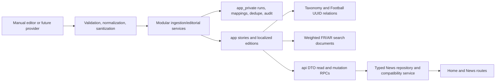

# Phase 4 — News and Editorial Content Domain

## Outcome

Phase 4 establishes BotolaGO V2's canonical editorial platform: story-based localization, normalized taxonomy and Football links, publication workflow, revisions, placements, saved ownership, French/Arabic full-text search, related content, trusted media, provider-neutral ingestion scaffolding, bounded public APIs, and Home/News repository cutover. It does not start notifications, Fantasy expansion, Admin CMS UI, production cron, or production deployment.

The architecture and frontend audit are in `NEWS_DOMAIN_PLAN.md`; operational and rollback procedures are in `NEWS_OPERATIONS_RUNBOOK.md`.

## Architecture

- `story` is the language-neutral identity/deduplication boundary.
- `article_edition` owns language-specific slug, title, deck, summary, sanitized body, SEO, status, visibility, schedule, publication time, and reading time.
- French and Arabic editions share one story; identity entities are never duplicated per language.
- Provider identifiers and operational metadata stay in `app_private` and never appear in public DTOs.
- `app` and `app_private` are non-exposed; `api` RPCs are the only browser surface.

## Frontend dependency map and cutover

The audit found one unpaginated mock list, hardcoded local category filtering, device-local saved IDs, detail-by-full-list scan, synthetic body paragraphs, client-side related ranking, bundled bilingual mock fields, gradient-only media, and no production search.

Cut over:

- Home lead and latest editorial modules.
- News feed and team filters.
- Article detail and real sanitized body.
- Related articles.
- Saved article read/save/unsave in Supabase mode.
- Trusted hero-media presentation.

The compatibility service maps provider-independent V2 DTOs into the frozen presentation model. Mock mode remains deterministic for preview/tests. Production requires explicit `VITE_NEWS_DATA_MODE=supabase` and never silently falls back.

## Localization model

One `app.stories` row may have at most one `app.article_editions` row per `app.language_code`. Slugs are unique per language. Taxonomy labels use relational translations. Public read RPCs require an explicit supported language and never substitute French content into Arabic responses. Future English requires extending the shared language model and adding editions/translations, not duplicating stories.

## Tables reused, modified, and created

Reused:

- `auth.users` for ownership and editorial actor attribution.
- Phase 2 profile/session infrastructure.
- Phase 3 `countries`, `competitions`, `teams`, and `players` canonical UUIDs.
- Phase 3 `media_assets` ownership model.

Modified additively:

- `app.media_kind` adds editorial media kinds.
- `app.media_assets` adds dimensions, MIME, alt/caption/credit/copyright/license/attribution metadata and accepts controlled `news/` paths.

Created in `app`:

- `authors`, `publishers`, `taxonomies`, `taxonomy_translations`;
- `stories`, `article_editions`, `article_revisions`;
- `story_taxonomies`, `story_competitions`, `story_teams`, `story_players`, `story_countries`;
- `editorial_placements`, `saved_articles`, `article_search_documents`.

Created in `app_private`:

- `editorial_memberships`, `editorial_audit_events`;
- `news_source_articles`, `news_duplicate_decisions`;
- `news_ingestion_runs`, `news_ingestion_rejections`.

## Migrations

- `20260720110053_news_editorial_catalog.sql` — editorial catalog, localization, taxonomy/Football relations, revisions, placements, ownership, constraints, triggers, RLS.
- `20260720110102_news_search_ingestion.sql` — weighted search, editorial authority, provider mapping/dedupe, observable ingestion, quarantine, audit.
- `20260720110107_news_api_security.sql` — public feeds/detail/search/related/taxonomy/team filters, saved RPCs, editorial workflow, service ingestion operations, explicit grants.
- `20260720110113_news_storage_index_hardening.sql` — trusted media bucket, covering/partial/composite indexes, explicit type resolution grants.
- `20260720114217_news_advisor_index_hardening.sql` — covering indexes for hosted foreign-key validation and cleanup paths.

All changes are greenfield V2, additive, replayable from zero, indexed, and non-destructive. They do not reference legacy migrations or modify the legacy project.

## Provider, ingestion, and deduplication

The provider contract includes bounded cursor pages, quota metadata, cancellation, normalized DTOs, stable provider errors, timeouts, bounded exponential backoff, jitter, and retry budgets. A deterministic fixture adapter validates the contract. No live provider is claimed.

The ingestion runner is modular, page-bounded, resumable, record-isolating, and run-tracked. The server gateway can start/finish runs and quarantine records, but canonical provider persistence intentionally fails closed pending an approved provider-specific mapping policy.

Deduplication precedence is external source ID, canonicalized HTTPS URL, exact SHA-256 content fingerprint, then a recorded manual decision. Mapping collisions and stale updates fail with stable errors. Raw payloads are excluded from canonical and operational tables.

## Sanitization and XSS prevention

The trusted boundary pins `sanitize-html@2.17.5` with a narrow editorial allowlist. Executable elements, event handlers, unsafe schemes, protocol-relative URLs, and uncontrolled attributes are removed. HTTPS media only is allowed; links receive safe `rel` attributes. Database constraints provide a second defense. Rendering uses only the stored sanitized `body_html`.

## Taxonomy, search, related content, and placements

- Categories, topics, and tags are normalized data with localized labels; they are not hardcoded database enums.
- Story relations point to canonical competition/team/player/country UUIDs.
- Search uses weighted PostgreSQL FTS, the French dictionary, Arabic normalization plus simple tokenization, and a GIN vector index. It never uses naive `%LIKE%` scans.
- Related ranking combines shared taxonomy, teams, competitions, players, and a bounded 180-day recency window.
- Backend placements support home/news lead, editor's pick, featured, breaking, and trending with language, scope, priority, and active windows.
- Transaction-scoped advisory locks prevent overlapping lead windows under concurrency.

## Media strategy

Hero, inline, author, publisher, and video-thumbnail assets reuse one canonical media table. `news-media` is public-read but has no browser write policies. Validated remote HTTPS references remain supported. UI fallbacks continue to work. Copying third-party assets remains blocked until redistribution and attribution rights are confirmed.

## Editorial roles and audit

- Editors: draft and revise.
- Publishers: schedule/publish/unpublish/archive and place.
- Admins: all prior capabilities plus soft delete.
- Service role: tracked ingestion operations only.

Optimistic edit conflicts use `expected_updated_at`. Status transitions are closed and tested. Material edits append revisions. Draft creation, status changes, content changes, placements, and soft deletion produce append-only audit events without secrets or raw tokens.

## API, DTOs, repositories, and saved content

DTO-shaped RPCs cover latest/filter feed, Home modules, article detail, related, full-text search, taxonomies, team filters, saved pagination, idempotent save/unsave, editorial workflow, and ingestion tracking. All collections are bounded; growing feeds use keyset cursors.

TypeScript DTOs validate media, bylines, taxonomy, cards, details, pages, Home modules, and filters with explicit nullability. The repository isolates every Supabase call from route components. Saved ownership is `(user_id, article_edition_id)`, unique, indexed, RLS-protected, idempotent, and server-authoritative in Supabase mode.

## RLS and grants

- Every Phase 4 `app` and `app_private` table enables and forces RLS.
- Browser roles have no direct canonical article write grants and no private-table privileges.
- Anonymous/authenticated public reads execute only bounded public RPCs.
- Draft/private/scheduled content is visible only to trusted editorial RPCs.
- Saved rows enforce `auth.uid()` ownership; frontend mutations use idempotent security-definer RPCs.
- Ingestion operations validate `auth.role() = service_role` and receive only explicit execute grants.
- No Phase 4 table is published to Realtime.

## Tests and local validation

Final values are completed at delivery time:

| Gate                   | Result                                                    |
| ---------------------- | --------------------------------------------------------- |
| Clean migration replay | PASS — 12 greenfield V2 migrations                        |
| pgTAP/RLS              | PASS — 174 assertions across 9 files                      |
| Application tests      | PASS — 269 tests, 667 assertions                          |
| Generated-type drift   | PASS                                                      |
| Database lint          | PASS after warning cleanup                                |
| Typecheck              | PASS                                                      |
| Build                  | PASS — client, SSR, Nitro                                 |
| ESLint                 | PASS — no errors; only pre-existing Fast Refresh warnings |
| Secret scan            | PASS                                                      |

Coverage includes localization linkage, slug uniqueness, sanitizer defense, search in both languages, related ranking, placements/conflicts, revisions, lifecycle transitions, soft delete, audit, public draft exclusion, save/unsave idempotency, cross-user denial, provider validation/pagination/retry, deterministic fingerprints, partial ingestion, DTO compatibility, and fail-closed production configuration.

## Performance findings

The public feed plan uses an index-only scan on `article_editions_public_feed_idx`. Search has a GIN vector index plus language/published keyset ordering. Relationship tables have reverse indexes for taxonomy/Football filtering and related ranking. Saved pagination, active placements, schedules, source mappings, ingestion operations, and audit lookup are indexed.

No route performs per-card queries or detail-by-full-list scans. Feed limits are at most 50 and keyset cursors avoid offset degradation. Redis is not justified before representative traffic. Response caching/ETags may be added after ingestion-driven invalidation and measured traffic exist.

## Staging validation

All five Phase 4 migrations were applied only to BotolaGO Staging V2 (`srdrflfrfpwixsllveid`) after local gates passed. Production V2 and legacy remain untouched.

- Hosted migration history contains foundation, Identity, Football, and all five News migrations in dependency order.
- All 21 Phase 4 canonical/private tables enable and force RLS.
- Anonymous and authenticated roles have zero direct privileges on canonical/private editorial tables.
- Anonymous feed execution is granted and an empty-data smoke call returns `{items: [], nextCursor: null}`.
- Anonymous ingestion execution is denied; `service_role` ingestion execution is granted.
- `news-media` is public-read, 10 MiB, and restricted to AVIF/JPEG/PNG/WebP; no browser write policy exists.
- Zero Phase 4 canonical tables are published to Realtime.
- Security advisor: zero errors/warnings; 20 informational no-policy notices are the intentional deny-all canonical/private design ([advisor explanation](https://supabase.com/docs/guides/database/database-linter?lint=0008_rls_enabled_no_policy)).
- The first performance advisor run found 14 informational uncovered foreign-key paths. `news_advisor_index_hardening` resolved all 14. The final run has zero uncovered Phase 4 foreign keys and only unused-index information expected on empty staging ([advisor explanation](https://supabase.com/docs/guides/database/database-linter?lint=0005_unused_index)).

## Remaining risks

- No production news provider, source contract, or media redistribution license is approved.
- Canonical provider persistence is intentionally disabled until that decision is reviewed.
- Arabic linguistic search quality needs representative editorial corpus evaluation; `simple` tokenization is safe but not full morphology.
- Search/related query plans require representative multi-year staging volume before final tuning.
- Sanitized HTML still requires a strict application Content Security Policy at deployment.
- Editorial role provisioning is service/admin operational work until a future Admin CMS exists.
- Phase 4 is stacked on unmerged Phase 2 and Phase 3 work and must follow dependency order.

## Rollback plan

1. Restore a reviewed staging build with `VITE_NEWS_DATA_MODE=mock`.
2. Stop ingestion invocations; there is no production schedule to disable.
3. Revert the Phase 4 application commit.
4. Leave additive schema dormant rather than executing destructive down SQL.
5. Before real content, disposable staging may be recreated from the prior reviewed migration set.
6. After content exists, export stories, editions, revisions, relations, placements, mappings, audit, and saves; use a reviewed forward repair.
7. Production V2 and legacy need no rollback because this phase does not modify them.

## Exact Phase 5 recommendation

After Phase 4 review, provider/media-rights decisions, and a representative staging soak, begin **Phase 5 — Production Notifications and Delivery Infrastructure** on a new branch. Build transactional notification preferences, event/outbox contracts, device/email delivery adapters, idempotency, retries, opt-out enforcement, quiet hours, localization, observability, and rate limits. Do not begin Fantasy scoring expansion, Admin CMS UI, analytics dashboards, production cron activation, or production deployment in Phase 5 unless separately approved.
