# Phase 5 — Notifications and Delivery Report

## Delivery status

Phase 5 is complete on `backend/notifications-domain` for code, local
verification, and V2 staging schema validation. Production V2 and the legacy
project were not modified. Push, product email, Realtime, Edge deployment, and
cron remain disabled. No live provider is claimed.

## 1. Architecture summary

Notifications is an independent event consumer. Identity, Football, News, and
future Fantasy own their facts; Notifications owns audience eligibility,
preferences, localization, quiet-hour timing, canonical in-app records,
per-channel delivery state, retry/dead-letter behavior, and operational
visibility.

```mermaid
flowchart LR
  P["Trusted domain producer"] --> E["Typed event RPC"]
  E --> D["Validate + deduplicate"]
  D --> L["Lease event"]
  L --> A["Keyset audience batches"]
  A --> R["Preferences + subscriptions + quiet hours"]
  R --> N["Canonical user notification"]
  N --> Q["Per-channel/device delivery"]
  Q --> W["Fixture or approved adapter"]
  W --> T["Attempts + retry + dead letter"]
  T --> M["Trusted metrics/audit"]
```

Durable claims and checkpoints live in PostgreSQL. Workers are bounded,
provider-neutral orchestrators. The browser can use only owner-scoped API
functions; it cannot create events, fan out, queue delivery, or access
operational state.

## 2. Frontend dependency map and cutover

The frozen frontend currently has no Notification Center route, unread badge,
push permission flow, PWA worker, native bridge, device screen, or notification
card interaction. It does have the Phase 2 onboarding/profile preferences:
match alerts, breaking news, Fantasy deadlines, and preferred language.

Phase 5:

- preserves those three server-authoritative switches in the single existing
  `app.user_preferences` row;
- adds provider-independent list/unread/read/dismiss/preference/device
  repositories for the future current-design UI;
- preserves deterministic mock repositories for preview and tests;
- requires Supabase mode in production and rejects mock/missing production
  configuration;
- introduces no route, component redesign, local-authoritative production
  state, or scattered component query.

## 3. Schema and migrations

Five greenfield V2, additive, replayable migrations were created:

1. `20260720121725_notification_catalog.sql`
   - enums and canonical preferences;
   - templates, private events, notifications, deliveries, devices,
     subscriptions;
   - constraints, ownership relationships, and initial comments.
2. `20260720121727_notification_delivery_runtime.sql`
   - fan-out runs, schedules, private destinations, immutable attempts, dead
     letters, and operational audit.
3. `20260720121729_notification_api_security.sql`
   - validation/rendering/quiet-hours helpers;
   - owner and service RPCs;
   - Identity security-event bridge;
   - forced RLS, grants/revokes, and deterministic bilingual templates.
4. `20260720121731_notification_index_hardening.sql`
   - feed/unread, audience, queue claim, retry, schedule, device, mapping, and
     audit indexes;
   - trusted operational metrics.
5. `20260720132048_notification_fanout_resume.sql`
   - returns the last committed user cursor when reclaiming an expired fan-out
     lease, making resume effective rather than only recorded.

No legacy table or migration was copied. No destructive drop or rewrite exists.

### Created in `app`

- `notification_templates`
- `notifications`
- `notification_deliveries`
- `device_registrations`
- `notification_subscriptions`

### Created in `app_private`

- `notification_events`
- `notification_fanout_runs`
- `notification_schedules`
- `push_destinations`
- `notification_delivery_attempts`
- `notification_dead_letters`
- `notification_operational_audit`

### Reused and extended

`app.user_preferences` remains the only preference source. Phase 5 adds
global/in-app/push/email switches, timezone, quiet hours, digest mode, and
Fantasy reminder timing while retaining Phase 2 category fields and defaults.

## 4. Event model

The stable envelope contains event UUID, internal type, source domain/entity,
optional target user, occurred timestamp, schema version 1, safe bounded
payload, unique deduplication key, and correlation UUID.

Zod event schemas isolate variables per supported event. Fantasy events are
declared but rejected by disabled handlers until the authoritative Fantasy
domain exists. The database rejects unsupported Fantasy ingestion, missing
Identity targets, invalid versions, malformed keys, future-skewed timestamps,
oversized payloads, and unauthorized callers.

The unique deduplication key returns the original event on duplicate ingestion.
`(event_id, user_id)` makes user notification creation idempotent.

Identity security audit events emit only supported password, account-deletion,
and sensitive-profile events through a narrow transactional trigger. Football
and News producers use the explicit trusted event boundary; notification logic
does not attach to their tables.

## 5. Preference model

Defaults are global/in-app on, push/email off, quiet hours off, Casablanca
timezone, immediate digest, and 24-hour future Fantasy reminder timing.
Existing match/news/Fantasy booleans remain backward-compatible.

Updates are one owner-scoped atomic RPC. IANA timezone existence, quiet-hour
pairing, non-equal boundaries, and reminder bounds are enforced by PostgreSQL.

Mandatory account/security templates override global/category/in-app opt-outs
for the canonical in-app record and may bypass quiet hours. Optional push/email
still require explicit channel consent; email additionally requires a verified
address and an approved provider. This prevents optional third-party delivery
from silently overriding user consent.

## 6. Template and localization model

Templates are versioned by key, channel, language, and version, with a single
active edition per combination. Required variables, maximum title/body
lengths, mandatory state, quiet-hour bypass, and activation state are
constrained.

French and Arabic are seeded for the supported deterministic in-app families.
Rendering rejects missing or unknown variables and preserves Arabic text. The
provider contract supports channel-specific templates; production push/email
templates and HTML/plain email design remain disabled until a provider and
copy are approved. Email variables are escaped and push/in-app control
characters are removed in the application renderer.

## 7. Fan-out strategy

Audience resolution is database-side, ordered by user UUID, and limited to
1–500 rows per call. It uses canonical profile/preference, follow, subscription,
fixture, and article relationships. No worker loads the full audience.

An event has one fan-out run with an expiring lease. Each committed batch stores
the last user UUID plus counters. A reclaimed stale lease now returns that
cursor, so the worker continues with the next user. Per-user uniqueness remains
a second defense against duplicated work.

Direct Identity targets bypass optional audience preferences only for the
mandatory canonical security record. News and Football audiences require the
relevant follows/subscriptions and category preferences.

## 8. Scheduling strategy

One-shot UTC schedules support idempotent create/reschedule, typed source,
timezone basis, attempts, cancellation, bounded claims, and stale-lock
recovery. Quiet-hour deferral uses the user IANA timezone and correctly handles
intervals that cross midnight; mandatory security may bypass.

No recurring production schedule exists. Future cron must invoke small,
bounded claim/process workers and receive separate cadence/concurrency
approval.

## 9. Provider abstraction, device, and email model

`NotificationDeliveryProvider` supports send, optional batch send, provider
message ID, retryability, invalid-destination detection, rate-limit metadata,
timeout/abort, and stable errors. The deterministic fixture adapter covers
success and permanent invalid destinations. The production resolver has no
implicit provider and therefore fails closed.

Device registration is owner-authenticated and multi-device. Safe metadata
lives in `app.device_registrations`; the raw destination is isolated in
`app_private.push_destinations`. Digest uniqueness blocks cross-user token
reassignment, registration rotates a destination transactionally, and public
list output never returns it. Invalid destinations disable the device.

Product email is separate from Supabase Auth email. Queueing requires explicit
email preference and a verified Auth email. The provider boundary can later
add HTML/plain templates, signed links, bounce/complaint webhook verification,
and anti-phishing review; no product email is sent in this phase.

## 10. Retry, dead letter, deep links, and observability

Retryable provider failures use bounded exponential backoff with jitter and an
attempt budget. Permanent/exhausted failures create a private dead letter.
Attempts are append-only and contain only stable error/sanitized provider
metadata. Trusted replay is status-checked, idempotent, and audited.

Deep links use a closed target enum plus canonical UUID where required. Match
and article targets are existence-checked. Arbitrary URLs, schemes, hosts, and
redirects cannot be stored.

Trusted metrics cover queue depth, event/fan-out/schedule state, delivery
outcomes, retry/dead-letter counts, provider latency/quota fields, and invalid
devices. Browser execution is revoked. Structured code paths never return raw
provider, PostgreSQL, or Supabase errors.

## 11. RLS and grants

All 12 Phase 5 canonical/private tables enable and force RLS. Browser roles
have zero direct grants. No permissive table policy is required because all
access is through narrowly granted, security-definer RPCs with empty search
paths and explicit caller/owner checks.

Authenticated users may list/mutate only their notification state, atomically
manage their preferences/subscriptions, and manage safe summaries for their
devices. They cannot create notifications/events, modify templates/deliveries,
read provider destinations, invoke fan-out, access audit/dead letters, or
trigger bulk send.

Only `service_role` may invoke event, fan-out, schedule, delivery,
invalidation, dead-letter, and metrics RPCs. It still has no direct private
table grants. No Phase 5 table was added to Realtime.

Supabase security advisor reports only expected INFO
`rls_enabled_no_policy` notices for deny-all tables. There are no Phase 5
WARN/ERROR findings. See the advisor remediation reference:
https://supabase.com/docs/guides/database/database-linter?lint=0008_rls_enabled_no_policy

## 12. Stable DTOs and repositories

Added:

- notification card/page/cursor, unread count, preference, deep-link, device,
  and event DTO schemas;
- Notification, Preference, and Device repository interfaces;
- Supabase owner-RPC repositories;
- deterministic mock repositories;
- server-only worker gateway;
- bounded fan-out and dispatch services;
- provider contracts, fixture adapter, and retry resilience;
- stable notification error mapping.

The generated V2 database types include the new schemas, enums, tables, and
RPCs. Archived legacy types are not imported.

## 13. Tests and quality results

Tests added cover:

- preference defaults/atomic update/timezone validation;
- French/Arabic templates, missing variables, escaping, and length guards;
- event envelope validation and unsupported Fantasy handling;
- event/user/delivery/device deduplication;
- owner notification feed, unread/read/unread/mark-all, and safe devices;
- cross-user, anonymous, browser-write, private-table, template, delivery, and
  worker boundaries;
- quiet hours crossing midnight and mandatory bypass;
- fan-out batching, filtering, committed checkpoint resume, and uniqueness;
- deterministic provider success, retry policy, permanent invalid device, and
  dispatch invalidation;
- generated DTO/mock repository behavior and production fail-closed mode.

Final local results:

| Gate                                  | Result                                                 |
| ------------------------------------- | ------------------------------------------------------ |
| Clean zero-to-latest migration replay | PASS — 17 migrations                                   |
| pgTAP/RLS                             | PASS — 217 assertions, 11 files                        |
| Database lint                         | PASS — no schema errors                                |
| Generated-type drift                  | PASS                                                   |
| Application tests                     | PASS — 288 tests, 704 expectations, 48 files           |
| Typecheck                             | PASS                                                   |
| Build                                 | PASS                                                   |
| ESLint                                | PASS — 0 errors; 11 pre-existing Fast Refresh warnings |
| Secret scan                           | PASS                                                   |

No test calls a live push or email provider.

## 14. Performance findings

V2 staging `EXPLAIN (FORMAT JSON)` checks select:

- `notifications_user_feed_idx` for keyset feed reads;
- `notifications_user_unread_idx` for unread state;
- `notification_deliveries_claim_idx` for delivery claims;
- `notification_schedules_due_idx` for due schedule claims.

Event/fan-out, subscriptions, devices, attempts, and audit paths have targeted
partial/composite indexes. Public feeds and all claims are bounded. Route-level
N+1 queries are avoided.

The performance advisor reports new indexes as unused INFO because staging has
no notification traffic yet. That is expected and not a reason to remove
access-path indexes before representative-volume tests. Production activation
still requires seeded volume plus `EXPLAIN (ANALYZE, BUFFERS)`, lock
contention, fan-out latency, and queue throughput measurements.

Advisor reference:
https://supabase.com/docs/guides/database/database-linter?lint=0005_unused_index

## 15. Staging validation

Target: `BotolaGO Staging V2` (`srdrflfrfpwixsllveid`), PostgreSQL 17.

- all five additive Notification migrations applied successfully;
- 12 Notification tables exist and all force RLS;
- anonymous direct notification reads: denied;
- authenticated direct notification writes: denied;
- authenticated private event reads: denied;
- 12 active deterministic bilingual templates exist;
- 25 controlled Notification/device API functions exist;
- fan-out reclaim function exposes the checkpoint resume contract;
- Phase 5 Realtime tables: 0;
- active cron job table: absent;
- production V2: untouched;
- legacy: untouched.

Staging validation was schema/security/plan validation only. It did not send
push/email, create cron, deploy an Edge Function, or generate user traffic.

## 16. Privacy, retention, and unresolved risks

Documented retention targets are 180 days for in-app notifications, 90 days
for delivery attempts/dead letters, 30 days for completed safe event/fan-out
payloads, 7 days for invalidated destinations, and 365 days for security audit.
No automated deletion job is activated yet.

Remaining risks:

- no push or transactional-email provider has been approved;
- no Notification Center, unread badge, device, Web Push/PWA, or native mobile
  UI currently exists in the frozen frontend;
- channel-specific production copy, email HTML/plain rendering, anti-phishing,
  bounce/complaint, and webhook signature verification require provider review;
- representative-volume fan-out/queue contention is not yet measured;
- retention enforcement needs a reviewed bounded maintenance job;
- Morocco/global timezone behavior depends on current PostgreSQL tzdata;
- mandatory security currently guarantees canonical in-app delivery; external
  channel override needs separate legal/product consent review.

## 17. Rollback plan

Phase 5 is dormant and additive:

1. stop manual staging workers;
2. leave provider/cron/Realtime disabled;
3. revert frontend/service code or use explicit mock mode outside production;
4. do not destructively down-migrate a database with notification data;
5. use a reviewed forward repair, or recreate disposable staging after
   exporting required evidence;
6. production and legacy require no rollback because they were not modified.

## 18. Exact Phase 6 recommendation

After Phase 5 PR review, make **Phase 6 — Canonical Fantasy Engine and
Competition Domain** the next isolated branch.

Phase 6 should first map the frozen Fantasy routes and then implement canonical
seasons/gameweeks, player eligibility and prices derived from stable Football
UUIDs, squads, budgets/formations, draft/finalization, transfer accounting,
chips, points/events, leagues/rankings, immutable scoring rules, correction
replay, server authority, RLS, DTO repositories, deterministic scoring
fixtures, and staging validation.

Fantasy may emit typed notification events only after it authoritatively
decides deadlines/results. Phase 6 must not activate production notification
providers/cron, build Admin CMS or analytics UI, deploy production, or make
Notifications compute Fantasy facts.
