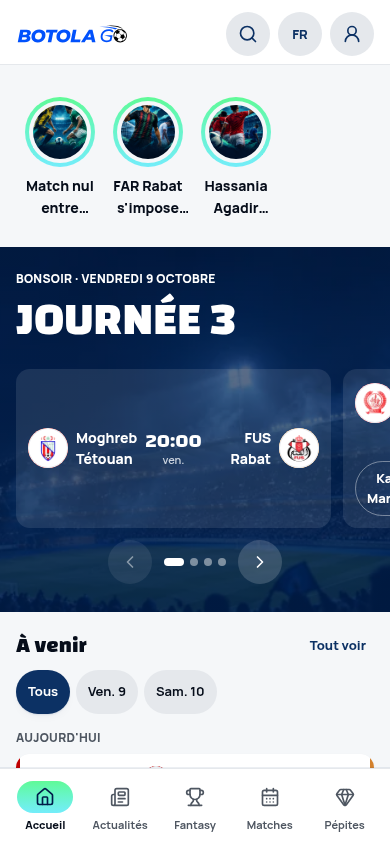
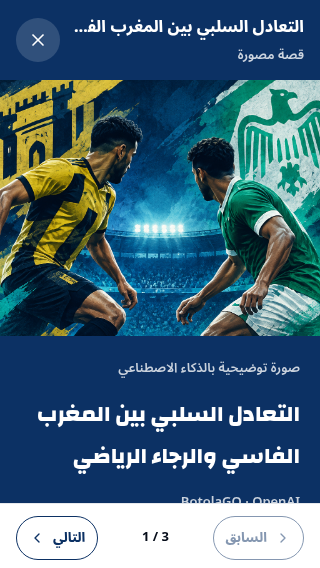

# Stories audit and repair brief — 10 October 2026 (Dubai)

Scope: Home story rail → open a story → read and navigate, French/Arabic,
320×568, 390×844 and 1440×900. Current live release: 28951f3d.
Fresh Chromium captures; in-app Browser tools are unavailable in this environment.

1. **Find a story — needs improvement.** The 80px-wide two-line labels truncate
   before the clubs are identifiable. The 3 images repeat the same blue collage
   treatment. Preserve the recognizable circles and horizontal scrolling.
2. **Read — broken on short screens.** On Arabic 320×568 the body is 455px tall
   inside a 423px viewport. Caption content runs behind the pinned footer.
   `object-cover` changes the image crop with viewport height; the caption hides
   another part of the image. The truncated duplicate headline and provider credit
   consume space without helping the reader. No image-loading/error state exists.
3. **Navigate — incomplete.** Buttons and Escape work; ArrowRight did not change
   the story in any audited viewport. No swipe handling exists. Keep focus trapping,
   translated controls, explicit buttons, and focus restoration.

The image worker explicitly requests anonymous players, stadium atmosphere, a
fixed navy/mint collage, and bans identifying text/logos. It receives a headline
and short summary but no structured match context. The database hardcodes
`BotolaGO · OpenAI` into the visible credit. Those are implementation causes,
not faults with the configured secret.

## Preserve

Brand tokens, circular rail, existing Home/business rules, bilingual exact news
headlines, transparent AI illustration disclosure, admin manual credits/uploads,
access controls, provider-secret isolation, generation caps and editorial unpublish.

## Fix

- A responsive viewer with the entire portrait visible, no artificial top margins,
  one headline, compact navigation, safe-area support and loading/error feedback.
- Keyboard arrows and directional swipes in both languages; readable rail labels.
- Hide provider credits for generated stories while preserving manual photo credits.
- Give the model structured facts and article context, vary compositions by news
  type, and use an editorial sports-poster treatment specific to the clubs/result.
  Never invent match facts or pass illustrations off as documentary photography.
- Replace the three existing generic images through bounded, audited regeneration;
  preserve current images until replacements publish successfully.

## Acceptance

Fresh before/after captures on short/normal phones and desktop, French/Arabic and
light/dark; full portrait and headline visible without obscured controls; working
buttons, arrows, swipes, Escape/focus; broken/slow image behavior; exact source
headlines; no provider credit on AI stories; manual credits retained. Relevant
unit tests, authoritative database CI, full application CI, safe production
rehearsal and real regenerated-image verification. Existing owner release
authorization applies to this correction of the deployed stories feature.

Screenshots support the visual findings; DOM measurements and interaction checks
support clipping/navigation findings. This is not a complete WCAG audit or a test
on physical iOS/Android devices. A transient unpainted French 320px capture was
rejected; the accepted Arabic capture demonstrates the layout defect.
