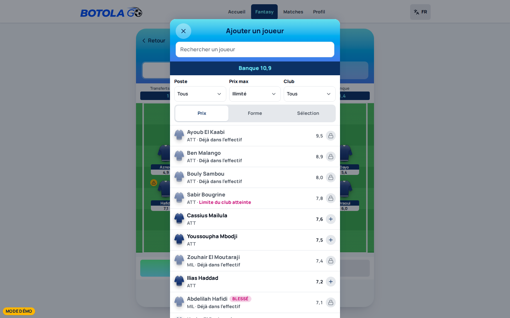
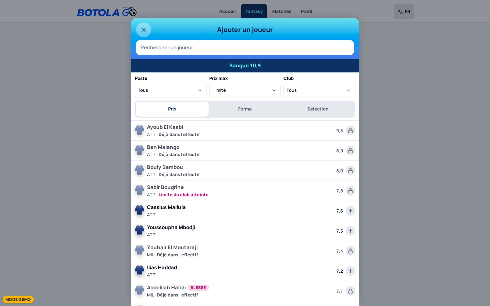

# Polish pass — measured before/after

Evidence for BG-0113 and for the integration fixes that precede it. Every entry
states what was measured, with what, and at which viewport, so a reader can
re-run it rather than take the screenshot's word for it.

Measurements are taken against a dev server this session started on its own
port — **never 4173**. That port is shared with other worktrees in this
sandbox, and a Playwright run that reuses an existing server there measures a
different tree entirely. That has already produced one false failure in this
project (`docs/engineering/LAUNCH_LEDGER.yaml`, BG-0091 notes).

The language chooser is a full-screen dialog on first load and will be the
`[role="dialog"]` any naive selector finds. Set `botolago.language` in
`localStorage` via an init script before navigating, or you will measure the
chooser and believe it is the sheet.

---

## `UiSheet` width — the sheet did not follow the column

**When** 2026-09-21, integrating lane BG-0118 (shell/hub) into
`chief/launch-fixes-3`.

**What changed upstream.** BG-0118 moved `FantasyFrame` off the 480px
`--ui-column-max` phone canvas onto `max-w-2xl` (672px), the same rule
`UiScreen width="content"` uses and the one Home, Matches, Standings and
Profile have used since the shell migration. That fixed the owner's desktop
complaint. `UiSheet` stayed pinned to `--ui-column-max`, deliberately, on the
reasoning that a bottom sheet should stay thumb-width.

**Why that reasoning inverts.** The 480px cap has no effect below 672px — the
sheet is already full-bleed on every phone. The only place it showed was
desktop, where thumb reach is not a constraint and a 480px sheet centred under
a 672px screen reads as a mistake. It is also where the picker's price and form
columns have room to come back.

**Measured**, `/fantasy/transfers` → "Ajouter un joueur", bounding boxes read
from the live DOM rather than from the screenshot:

| viewport | frame | sheet before | sheet after                      |
| -------- | ----- | ------------ | -------------------------------- |
| 390px    | 390px | 390px @x=0   | 390px @x=0 — unchanged           |
| 1440px   | 672px | 480px @x=480 | 672px @x=384 — matches the frame |

At 1440 the sheet now sits at x=384 with 384px of gutter on both sides, so it
is centred on the same axis as the column rather than inset within it. Phones
are untouched, which is the point: this was only ever a desktop defect.

`ui-kit.contract.test.ts` 98 pass / 0 fail.

---

## BG-0124 — the type ramp had no leading, and it was cutting glyphs

**When** 2026-09-21, the first item of the polish pass proper.

**What was wrong.** `ui.text.micro` and the whole stat ramp carried
`leading-none`: a line box exactly the font size. No font's ink fits inside
its own em, so the line box was always too short. That is invisible until
something hides the overflow — and `truncate` does, because it sets
`overflow: hidden` to get a horizontal ellipsis and clips the vertical axis as
a side effect. CSS gives no way out of that pairing: set `overflow-x: hidden`
and `overflow-y` computes to `auto`, never `visible`. The only fix is
vertical room.

**Measured from the font's own metrics** (canvas `TextMetrics`, on the live
bottom nav at 390px — the most-seen element in the product):

|                         | line box | ink extent | cut                                      |
| ----------------------- | -------- | ---------- | ---------------------------------------- |
| **before** fr "Fantasy" | 0 … 11   | 2 … 13     | 2px of descender                         |
| **before** ar "فانتازي" | 0 … 11   | −1 … 15    | 1px top + 4px bottom, **31% of the ink** |
| **after** fr            | 0 … 15   | 4.2 … 15.2 | none                                     |
| **after** ar            | 0 … 21   | 4.2 … 20.2 | none                                     |

**The fix.** `--ui-leading-flat` / `-copy` / `-prose` on `:root`, applied
through every step of the ramp, redeclared under `:lang(ar)` / `[dir="rtl"]`.
Three steps rather than more, because anything below the Latin floor is
unusable and "tight" therefore _is_ the floor.

The Arabic values are arithmetic, not taste. For a line box `L` and a font of
ascent `A`, descent `D` and ink descent `d`, the baseline sits at
`(L − A − D)/2 + A`, so ink clears the bottom edge only once `L ≥ A − D + 2d`.
At 11px: Manrope needs 15px (ratio **1.36**), Noto Sans Arabic needs 19px
(**1.73**). Those are font properties, which is exactly why one leading value
cannot serve both scripts.

Shipped Arabic `flat` is **1.95**, not 1.73, and the gap is deliberate: 1.73
is what _one measured string_ needs, and the floor has to hold for the string
nobody measured. Across the product the deepest Arabic ink wanted 66/34,
37/19 and 25/13 — 1.94, 1.95, 1.92 — so 1.95 is an observed ceiling. Only
`flat` is raised that far; `copy` and `prose` wrap, so their overflow is
visible and their ink is free, and inflating them would only make Arabic
paragraphs airy beside French ones.

**Cost, measured.** The bottom nav grows: label box 11px → 15px (fr) and
11px → 21px (ar), nav height 64px (fr) / 70px (ar), both inside the fixed
`--bottomnav-h` and both reporting `scrollHeight <= clientHeight`. Arabic is
6px taller than French, which is the honest consequence of the script needing
more room.

**Across the app**, `scripts/qa/layout-probe.mjs` over 16 routes × 4 widths ×
2 languages: `clipH` **1200 → 0**.

Two call sites were part of it. `BottomNav` set a local `leading-none` that
overrode the ramp on the one element this defect hurt most.
`FantasySummaryCard` carried a `[line-height:1.35]` workaround from BG-0122,
which was itself below the 1.36 Latin floor and far below Arabic's — it is
gone, and the token governs. `CompetitionHeader` was converted off three
literal sizes (13px, 10px, 10px) onto the ramp, which is what was cutting
"البطولة الاحترافية إنوي" on every Matches screen in Arabic.

### A fourth correction to the probe, and the important one

`clipH` over-reported once the leading rose. `scrollHeight` on a text leaf
reflects the **inline box**, sized from the font's _declared_ ascent and
descent — room for the tallest glyph the face can draw, not for the glyphs on
screen. Between the real ink height and that declared box,
`scrollHeight > clientHeight` keeps firing while nothing is visibly cut. The
Arabic hero lands exactly there: a 72px declared box against a 66px line box,
with the ink of "فانتازي" spanning 15.1 … 60.1 — comfortably inside.

The probe now measures ink directly and splits the two, so `clipH` means a cut
glyph and `clipHFontBox` means geometry. Both are printed; neither is dropped.

One more thing this cost: the edit adding `clipHFontBox` to the results guard
silently did not apply, so rows whose only finding was a font-box overflow
were never recorded and the run printed a clean `0`. It looked like the best
possible result, which is the reason to distrust it. Always cross-check a
"clean" run against a single element measured by hand.
