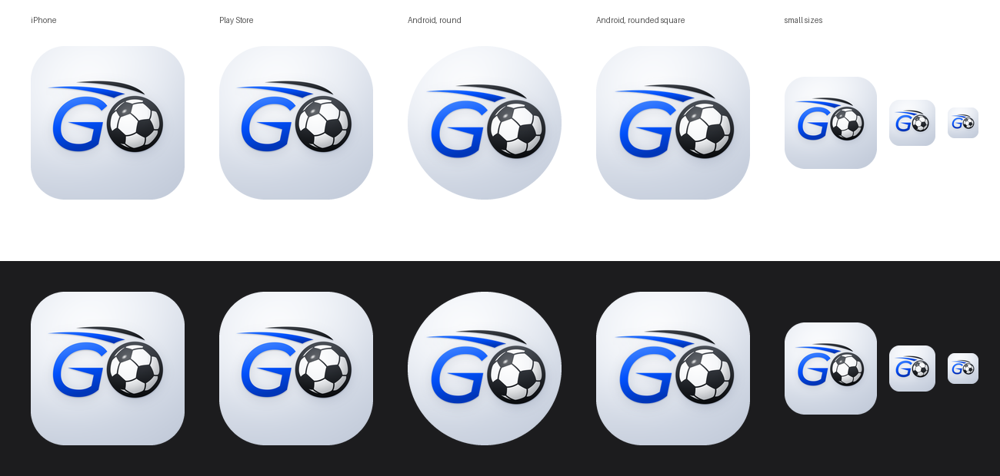

# App icon for the App Store and Google Play

The white 3D "GO" icon: the official mark (G, ball, both swooshes) with
shading, on a lit off-white plate, with a soft shadow under the mark.



Every file here is generated. To change the icon, edit
[`scripts/brand/make-app-icons.py`](../../scripts/brand/make-app-icons.py) and
run it again; do not edit the PNGs by hand.

```sh
pip install pillow cairosvg numpy
python3 scripts/brand/make-app-icons.py
```

## Files

| File                                  | Where it goes                                                                                                                               |
| ------------------------------------- | ------------------------------------------------------------------------------------------------------------------------------------------- |
| `ios/AppIcon-1024.png`                | App Store Connect and the Xcode `AppIcon` set. 1024×1024, no transparency, sRGB.                                                            |
| `android/play-store-icon-512.png`     | Google Play Console, store listing icon. 512×512, 32-bit, fully opaque.                                                                     |
| `android/adaptive-foreground-432.png` | Android adaptive icon, foreground layer (108dp at xxxhdpi). The mark stays inside the 66dp safe circle that no phone's icon shape cuts off. |
| `android/adaptive-background-432.png` | Android adaptive icon, background layer.                                                                                                    |
| `android/adaptive-monochrome-432.png` | Android themed icon (the one-colour version phones tint to match the wallpaper).                                                            |
| `icon-composer/*.svg`                 | Flat layers for Apple's Icon Composer, for the iOS 26+ glass look. See below.                                                               |
| `preview.png`                         | How it looks on each store and phone shape, on light and dark wallpapers.                                                                   |
| `native/`                             | The phone app's own files, laid out as they go into the native projects. See below.                                                         |

## The phone app's files (`native/`)

The cloud build copies these into the projects Capacitor creates, as they are
(`scripts/mobile/prepare-native.mjs`, see `docs/mobile/PHONE_APP.md`). Nobody
copies them by hand.

| Folder                          | Goes to                                          | What                                                                                                                                                                                                                |
| ------------------------------- | ------------------------------------------------ | ------------------------------------------------------------------------------------------------------------------------------------------------------------------------------------------------------------------- |
| `native/ios/AppIcon.appiconset` | `ios/App/App/Assets.xcassets/AppIcon.appiconset` | The iPhone icon: the 1024 image above, as Capacitor's template names it.                                                                                                                                            |
| `native/ios/Splash.imageset`    | `ios/App/App/Assets.xcassets/Splash.imageset`    | The launch screen: the flat GO mark on `#F2F5FA`, 2732×2732. The screen shows the middle of it.                                                                                                                     |
| `native/android/res`            | `android/app/src/main/res`                       | The adaptive icon (`mipmap-anydpi-v26`, and its three layers at every density), the flat icons older phones use, the notification icon `ic_stat_notify` (white on transparent), the launch images, and two colours. |

The adaptive icon in `native/android/res` is wired up like this:

```xml
<!-- res/mipmap-anydpi-v26/ic_launcher.xml -->
<adaptive-icon xmlns:android="http://schemas.android.com/apk/res/android">
    <background android:drawable="@mipmap/ic_launcher_background" />
    <foreground android:drawable="@mipmap/ic_launcher_foreground" />
    <monochrome android:drawable="@mipmap/ic_launcher_monochrome" />
</adaptive-icon>
```

## Things to know

- **The 3D look is drawn into the iOS icon.** Apple accepts this, but since
  iOS 26 it recommends leaving shine and shadows out and letting the system
  add its own glass effect. The PNG is fine to submit as it is. For the
  native glass look, build an Icon Composer file from the four layers in
  `icon-composer/` (numbered back to front) on a gradient background from `#FFFFFF` to `#D6DDE7`.
- **Dark and tinted iPhone icons are optional.** iOS makes them itself if
  the app does not supply them.
- **The swooshes get very thin at the smallest sizes** (Settings, Spotlight,
  notifications). They are still recognisable, but if that ever bothers you,
  the same icon without swooshes can be used for the small sizes only.
